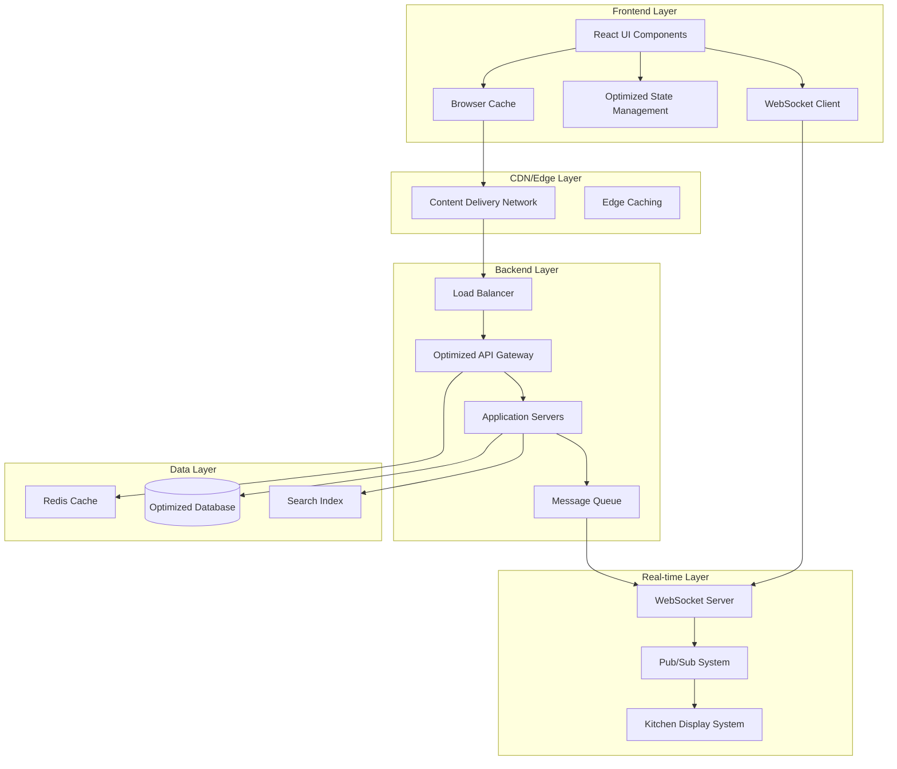

# Design Document: Fast Order Creation Optimization

## Overview

The fast order creation optimization system is designed to eliminate latency and provide a smooth, responsive ordering experience through a multi-layered performance architecture. The system employs frontend optimizations (React performance patterns, optimistic updates, progressive loading), backend enhancements (API optimization, intelligent caching, database query optimization), and real-time synchronization (WebSocket connections, event-driven updates) to achieve sub-second response times across all user interactions.

Key performance targets:
- UI interactions: <50ms visual feedback
- API responses: <500ms for 95% of requests  
- Order processing: <1s end-to-end
- Real-time updates: <3s propagation

## Architecture

The system follows a performance-first architecture with multiple optimization layers:



## Components and Interfaces

### Frontend Performance Layer

**OptimizedOrderInterface**
- Implements React.memo, useCallback, and useMemo for render optimization
- Uses virtual scrolling for large menu lists
- Implements code splitting with React.lazy for faster initial load
- Provides optimistic UI updates for immediate user feedback

```typescript
interface OptimizedOrderInterface {
  // Optimistic state management
  addItemOptimistically(item: MenuItem, quantity: number): void
  updateCartOptimistically(cartId: string, updates: CartUpdate): void
  
  // Performance-optimized rendering
  renderVirtualizedMenu(items: MenuItem[], viewport: Viewport): JSX.Element
  preloadMenuImages(items: MenuItem[]): Promise<void>
  
  // State synchronization
  syncWithServer(): Promise<void>
  handleConflictResolution(conflicts: StateConflict[]): void
}
```

**CacheManager**
- Implements multi-level caching (browser, memory, service worker)
- Provides intelligent cache invalidation and background refresh
- Supports offline-first functionality with cache-first strategies

```typescript
interface CacheManager {
  // Multi-level caching
  get<T>(key: string, level: CacheLevel): Promise<T | null>
  set<T>(key: string, value: T, ttl: number, level: CacheLevel): Promise<void>
  
  // Background refresh
  refreshInBackground(keys: string[]): Promise<void>
  invalidatePattern(pattern: string): Promise<void>
  
  // Offline support
  enableOfflineMode(): void
  syncWhenOnline(): Promise<void>
}
```

### Backend Performance Layer

**OptimizedAPIGateway**
- Implements request batching and response compression
- Provides intelligent routing and load balancing
- Supports connection pooling and keep-alive connections

```typescript
interface OptimizedAPIGateway {
  // Request optimization
  batchRequests(requests: APIRequest[]): Promise<APIResponse[]>
  compressResponse(response: APIResponse): CompressedResponse
  
  // Connection management
  getPooledConnection(endpoint: string): Connection
  enableKeepAlive(connection: Connection): void
  
  // Performance monitoring
  trackResponseTime(endpoint: string, duration: number): void
  getPerformanceMetrics(): PerformanceMetrics
}
```

**DatabaseOptimizer**
- Implements query optimization and connection pooling
- Provides read replicas and write optimization
- Supports intelligent indexing and query caching

```typescript
interface DatabaseOptimizer {
  // Query optimization
  optimizeQuery(query: SQLQuery): OptimizedQuery
  useReadReplica(query: ReadQuery): Promise<QueryResult>
  
  // Connection management
  getPooledConnection(): DatabaseConnection
  enableQueryCache(query: string, ttl: number): void
  
  // Index management
  createOptimalIndexes(tables: string[]): Promise<void>
  analyzeQueryPerformance(): QueryAnalysis[]
}
```

### Real-time Communication Layer

**WebSocketManager**
- Manages WebSocket connections with automatic reconnection
- Implements message queuing and delivery guarantees
- Provides fallback to polling for unreliable connections

```typescript
interface WebSocketManager {
  // Connection management
  connect(endpoint: string): Promise<WebSocketConnection>
  reconnectWithBackoff(): Promise<void>
  
  // Message handling
  sendMessage(message: WSMessage): Promise<void>
  queueMessage(message: WSMessage): void
  
  // Fallback mechanisms
  enablePollingFallback(): void
  switchToWebSocket(): Promise<void>
}
```

**KitchenDisplaySync**
- Synchronizes order data with kitchen display systems
- Handles print queue optimization and error recovery
- Provides real-time status updates and notifications

```typescript
interface KitchenDisplaySync {
  // Order synchronization
  syncOrderToKitchen(order: Order): Promise<void>
  updateOrderStatus(orderId: string, status: OrderStatus): Promise<void>
  
  // Print management
  queuePrintJob(job: PrintJob): Promise<void>
  retryFailedPrints(): Promise<void>
  
  // Display management
  updateKitchenDisplay(displayId: string, orders: Order[]): Promise<void>
  handleDisplayOffline(displayId: string): void
}
```

## Data Models

### Performance-Optimized Order Model

```typescript
interface OptimizedOrder {
  id: string
  customerId: string
  items: OrderItem[]
  totals: OrderTotals
  status: OrderStatus
  timestamps: OrderTimestamps
  
  // Performance fields
  cacheKey: string
  lastModified: number
  version: number
  
  // Optimization methods
  calculateTotals(): OrderTotals
  validateItems(): ValidationResult
  serialize(): SerializedOrder
}

interface OrderItem {
  menuItemId: string
  quantity: number
  customizations: ItemCustomization[]
  price: number
  
  // Cached data for performance
  cachedMenuItem?: MenuItem
  cachedPrice?: number
}
```

### Cache-Optimized Menu Model

```typescript
interface CachedMenuItem {
  id: string
  name: string
  description: string
  price: number
  category: string
  availability: boolean
  
  // Performance optimizations
  imageUrl: string
  thumbnailUrl: string
  preloadedImage?: HTMLImageElement
  
  // Cache metadata
  cacheTimestamp: number
  ttl: number
  popularity: number
}
```

### Real-time State Model

```typescript
interface RealTimeState {
  orders: Map<string, Order>
  kitchenQueue: Order[]
  activeConnections: Set<string>
  
  // Performance tracking
  lastUpdate: number
  pendingUpdates: StateUpdate[]
  conflictResolution: ConflictResolver
  
  // Synchronization
  sync(): Promise<void>
  applyUpdate(update: StateUpdate): void
  resolveConflicts(): Promise<void>
}
```

## Correctness Properties

*A property is a characteristic or behavior that should hold true across all valid executions of a system—essentially, a formal statement about what the system should do. Properties serve as the bridge between human-readable specifications and machine-verifiable correctness guarantees.*

Before writing the correctness properties, I need to analyze the acceptance criteria from the requirements document to determine which ones are testable as properties.

<function_calls>
<invoke name="prework">
<parameter name="featureName">fast-order-creation-optimization

Based on the prework analysis, I'll now convert the testable acceptance criteria into correctness properties:

**Property 1: UI Response Time Consistency**
*For any* user interaction (clicks, typing, navigation, cart updates), the system should provide visual feedback within the specified time thresholds (50ms for clicks, 100ms for typing/cart updates, 200ms for navigation)
**Validates: Requirements 1.1, 1.2, 1.3, 1.4, 3.2**

**Property 2: Menu Loading Performance**
*For any* menu data request, the system should display categories and items within 500ms, with search results appearing within 200ms and item details loading within 300ms
**Validates: Requirements 2.1, 2.2, 2.3**

**Property 3: Optimistic Update Consistency**
*For any* cart modification (add, remove, update quantities), the UI should update immediately before server confirmation, and conflicts should be resolved gracefully without data loss
**Validates: Requirements 3.1, 3.3, 3.5**

**Property 4: Payment Processing Performance**
*For any* payment operation, validation should complete within 300ms, confirmation within 500ms, and errors should display within 200ms while preserving order data
**Validates: Requirements 4.1, 4.3, 4.4**

**Property 5: API Response Time Distribution**
*For any* API request, 95% should respond within 500ms, with database queries completing within 200ms, maintaining performance under concurrent load
**Validates: Requirements 5.1, 5.2, 5.3**

**Property 6: Cache Performance Guarantee**
*For any* cached data request, memory cache should serve within 10ms, session data should retrieve without database queries, and background refresh should not block user operations
**Validates: Requirements 6.1, 6.2, 6.3**

**Property 7: Cache Eviction Behavior**
*For any* cache at capacity, the system should evict least recently used data intelligently without affecting active user sessions
**Validates: Requirements 6.4**

**Property 8: Real-time Update Propagation**
*For any* order or status change, kitchen displays should update within 2 seconds, all connected clients within 3 seconds, maintaining consistency across multiple users
**Validates: Requirements 7.1, 7.2, 7.3, 10.1, 10.2**

**Property 9: Offline Resilience**
*For any* network connectivity loss, the system should queue updates locally and sync automatically when connection is restored, maintaining data integrity
**Validates: Requirements 7.4, 10.4**

**Property 10: Error Recovery Consistency**
*For any* error condition (network, server, validation), the system should retry with exponential backoff, preserve user data, display helpful messages, and restore state upon recovery
**Validates: Requirements 8.1, 8.2, 8.3, 8.4**

**Property 11: Progressive Loading Behavior**
*For any* application load, core interface should appear within 1 second, with images showing placeholders before progressive loading completes
**Validates: Requirements 9.1, 9.2**

**Property 12: Print Queue Non-blocking**
*For any* busy print queue scenario, order processing should continue without blocking, with jobs queued and retried as needed
**Validates: Requirements 10.3**

**Property 13: Performance Monitoring Coverage**
*For any* system operation, response times should be tracked, performance metrics collected, alerts sent when thresholds exceeded, and dashboards updated in real-time
**Validates: Requirements 11.1, 11.2, 11.3, 11.4**

**Property 14: Network Optimization Effectiveness**
*For any* API communication, requests should be batched when possible, responses compressed, images optimized for format and size, and payloads minimized
**Validates: Requirements 12.1, 12.2, 12.3, 12.5**

**Property 15: Configuration Change Resilience**
*For any* system configuration change (KOT disable/enable, mode switching), the system should maintain order flow, preserve user context, update UI immediately, and resolve conflicts automatically
**Validates: Requirements 13.1, 13.2, 13.3, 13.4, 13.5**

## Error Handling

The system implements comprehensive error handling across all layers:

### Frontend Error Handling
- **Network Errors**: Automatic retry with exponential backoff (1s, 2s, 4s, 8s max)
- **Validation Errors**: Real-time field-level validation with specific error messages
- **State Conflicts**: Optimistic update rollback with user notification and retry options
- **Offline Handling**: Graceful degradation with local storage and sync queue

### Backend Error Handling
- **Database Errors**: Connection pool failover and query retry mechanisms
- **Cache Misses**: Automatic fallback to database with background cache warming
- **Service Failures**: Circuit breaker pattern with health checks and graceful degradation
- **Rate Limiting**: Intelligent throttling with priority queuing for critical operations

### Real-time Error Handling
- **WebSocket Disconnection**: Automatic reconnection with message queue persistence
- **Kitchen Display Failures**: Order storage with automatic sync when displays reconnect
- **Print Failures**: Job queuing with retry logic and manual intervention alerts

## Testing Strategy

The testing strategy employs a dual approach combining unit tests for specific scenarios and property-based tests for comprehensive coverage:

### Property-Based Testing
- **Framework**: Use Jest with fast-check for JavaScript/TypeScript property testing
- **Configuration**: Minimum 100 iterations per property test to ensure statistical confidence
- **Coverage**: Each correctness property implemented as a separate property-based test
- **Tagging**: Each test tagged with format: **Feature: fast-order-creation-optimization, Property {number}: {property_text}**

### Unit Testing Balance
- **Specific Examples**: Focus on concrete user scenarios and edge cases
- **Integration Points**: Test component interactions and API integrations
- **Error Conditions**: Verify specific error handling and recovery scenarios
- **Performance Benchmarks**: Validate specific timing requirements with controlled tests

### Performance Testing
- **Load Testing**: Simulate concurrent users and measure response time distribution
- **Stress Testing**: Test system behavior under extreme load conditions
- **Endurance Testing**: Verify performance stability over extended periods
- **Real-time Testing**: Validate WebSocket performance and message delivery guarantees

### Testing Tools and Configuration
- **Frontend**: Jest, React Testing Library, fast-check for property tests
- **Backend**: pytest, hypothesis for Python property testing, load testing with locust
- **Integration**: Cypress for end-to-end testing, WebSocket testing with custom harnesses
- **Performance**: Artillery for load testing, Chrome DevTools for frontend performance profiling

Each property-based test must reference its corresponding design document property and validate the universal behavior across all valid inputs, ensuring the system maintains performance guarantees under all conditions.