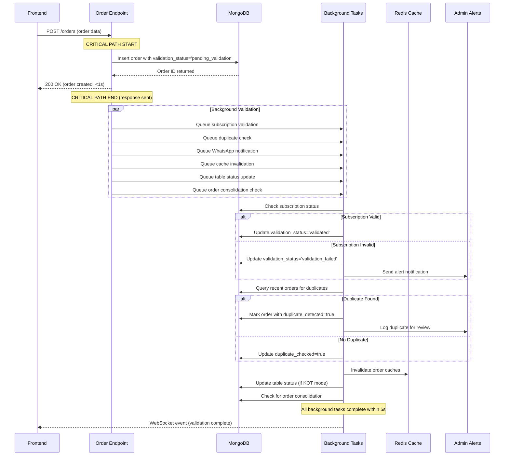
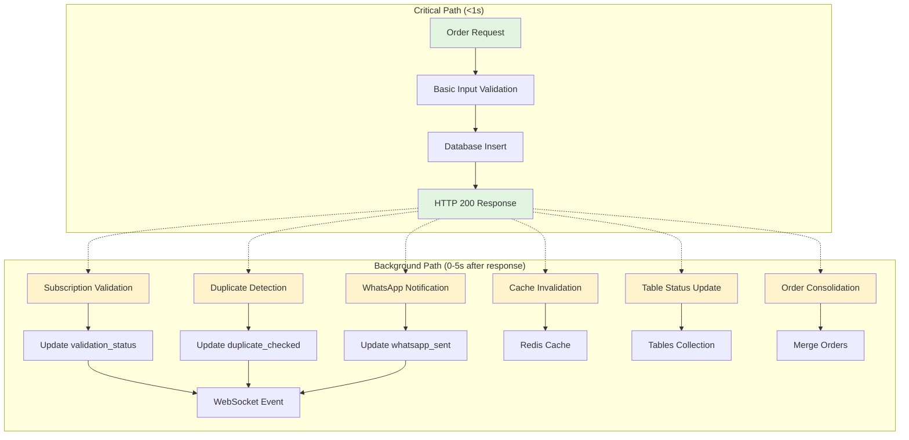

# Design Document: Fast Order Creation Optimization

## Overview

The fast order creation optimization eliminates blocking operations from the order creation critical path by moving subscription validation (~10ms) and duplicate checks (~50ms) to background tasks. Currently, the `/orders` endpoint blocks on these validations before inserting the order into the database, resulting in 2-4 second response times. This design moves these checks to FastAPI background tasks that execute after the HTTP response is sent, reducing the critical path to just the database insert (~100ms) for sub-1-second order creation.

The system maintains data consistency through order validation markers, graceful failure handling, and event-driven frontend updates. Orders are created immediately with a `pending_validation` marker, then background tasks update the marker to `validated` or `validation_failed` based on subscription and duplicate check results. Failed validations trigger admin alerts but never delete orders, ensuring zero data loss.

Key design principles:
- Critical path contains only database insert (~100ms target)
- Background tasks execute after response sent (non-blocking)
- Validation failures handled gracefully without order deletion
- Frontend receives immediate response with optimistic updates
- Event-driven updates notify frontend of validation completion
- Zero frontend errors policy through silent background validation


## Architecture

The system follows a background validation architecture where the critical path is minimized to essential operations only:


```mermaid
sequenceDiagram
    participant Client as Frontend
    participant API as Order Endpoint
    participant DB as MongoDB
    participant BG as Background Tasks
    participant Cache as Redis Cache
    participant Admin as Admin Alerts

    Client->>API: POST /orders (order data)
    
    Note over API: CRITICAL PATH START
    API->>DB: Insert order with validation_status='pending_validation'
    DB-->>API: Order ID returned
    API-->>Client: 200 OK (order created, <1s)
    Note over API: CRITICAL PATH END (response sent)
    
    par Background Validation
        API->>BG: Queue subscription validation
        API->>BG: Queue duplicate check
        API->>BG: Queue WhatsApp notification
        API->>BG: Queue cache invalidation
        API->>BG: Queue table status update
        API->>BG: Queue order consolidation check
    end
    
    BG->>DB: Check subscription status
    alt Subscription Valid
        BG->>DB: Update validation_status='validated'
    else Subscription Invalid
        BG->>DB: Update validation_status='validation_failed'
        BG->>Admin: Send alert notification
    end
    
    BG->>DB: Query recent orders for duplicates
    alt Duplicate Found
        BG->>DB: Mark order with duplicate_detected=true
        BG->>Admin: Log duplicate for review
    else No Duplicate
        BG->>DB: Update duplicate_checked=true
    end
    
    BG->>Cache: Invalidate order caches
    BG->>DB: Update table status (if KOT mode)
    BG->>DB: Check for order consolidation
    
    Note over BG: All background tasks complete within 5s
    BG-->>Client: WebSocket event (validation complete)
```


### Data Flow: Critical Path vs Background Path


```mermaid
graph TB
    subgraph "Critical Path (<1s)"
        Request[Order Request] --> Validate[Basic Input Validation]
        Validate --> Insert[Database Insert]
        Insert --> Response[HTTP 200 Response]
    end
    
    subgraph "Background Path (0-5s after response)"
        Response -.-> BG1[Subscription Validation]
        Response -.-> BG2[Duplicate Detection]
        Response -.-> BG3[WhatsApp Notification]
        Response -.-> BG4[Cache Invalidation]
        Response -.-> BG5[Table Status Update]
        Response -.-> BG6[Order Consolidation]
        
        BG1 --> Update1[Update validation_status]
        BG2 --> Update2[Update duplicate_checked]
        BG3 --> Update3[Update whatsapp_sent]
        BG4 --> Cache[Redis Cache]
        BG5 --> Tables[Tables Collection]
        BG6 --> Merge[Merge Orders]
        
        Update1 --> Event[WebSocket Event]
        Update2 --> Event
        Update3 --> Event
    end
    
    style Request fill:#e1f5e1
    style Response fill:#e1f5e1
    style BG1 fill:#fff3cd
    style BG2 fill:#fff3cd
    style BG3 fill:#fff3cd
    style BG4 fill:#fff3cd
    style BG5 fill:#fff3cd
    style BG6 fill:#fff3cd
```


## Components and Interfaces

### OrderEndpoint (Modified)

The main order creation endpoint with background task orchestration:

```python
@api_router.post("/orders", response_model=Order)
async def create_order(
    order_data: OrderCreate,
    background_tasks: BackgroundTasks,
    current_user: dict = Depends(get_current_user)
):
    """
    Create order with minimal critical path - only database insert blocks response.
    All validation and side effects happen in background tasks.
    """
    # CRITICAL PATH START
    user_org_id = get_secure_org_id(current_user)
    
    # Basic input validation (fast, in-memory)
    if not order_data.items or len(order_data.items) == 0:
        raise HTTPException(status_code=400, detail="Order must contain at least one item")
    
    # Calculate totals (fast, in-memory)
    subtotal, tax, total = calculate_order_totals(order_data.items, business_settings)
    
    # Create order object with pending validation status
    order_obj = Order(
        table_id=order_data.table_id or "counter",
        table_number=order_data.table_number or 0,
        items=[item.model_dump() for item in order_data.items],
        subtotal=subtotal,
        tax=tax,
        total=total,
        waiter_id=current_user["id"],
        waiter_name=current_user["username"],
        customer_name=order_data.customer_name,
        customer_phone=order_data.customer_phone,
        organization_id=user_org_id,
        status=order_data.status or "pending",
        validation_status="pending_validation",  # NEW FIELD
        duplicate_checked=False,  # NEW FIELD
        subscription_validated=False  # NEW FIELD
    )
    
    # Database insert (only blocking operation)
    await db.orders.insert_one(order_obj.model_dump())
    
    # Return response immediately
    response = order_obj.model_dump()
    # CRITICAL PATH END (<100ms target)
    
    # Queue background tasks (non-blocking)
    background_tasks.add_task(validate_subscription_background, order_obj.id, user_org_id, current_user)
    background_tasks.add_task(check_duplicate_background, order_obj.id, order_data, user_org_id)
    background_tasks.add_task(send_whatsapp_notification_background, order_obj.id, order_data, business_settings)
    background_tasks.add_task(invalidate_caches_background, user_org_id, order_obj.id)
    background_tasks.add_task(update_table_status_background, order_data.table_id, order_obj.id, user_org_id)
    background_tasks.add_task(check_order_consolidation_background, order_obj.id, order_data, user_org_id)
    
    return response
```


### SubscriptionValidator (Background Task)

Validates subscription status after order creation:

```python
async def validate_subscription_background(
    order_id: str,
    org_id: str,
    user: dict,
    max_retries: int = 3
):
    """
    Background task: Validate subscription status after order is created.
    Updates order validation_status field based on result.
    Never deletes orders - only marks validation status.
    """
    retry_count = 0
    backoff_seconds = 1
    
    while retry_count < max_retries:
        try:
            # Check subscription (existing function)
            subscription_status = await check_subscription(user)
            
            if subscription_status["allowed"]:
                # Subscription valid - mark order as validated
                await db.orders.update_one(
                    {"id": order_id},
                    {
                        "$set": {
                            "validation_status": "validated",
                            "subscription_validated": True,
                            "subscription_check_timestamp": datetime.now(timezone.utc).isoformat()
                        }
                    }
                )
                logger.info(f"✅ Order {order_id} subscription validated")
                
                # Emit event for frontend update
                await emit_order_validation_event(order_id, "validated")
                return
            else:
                # Subscription invalid - mark but don't delete
                await db.orders.update_one(
                    {"id": order_id},
                    {
                        "$set": {
                            "validation_status": "validation_failed",
                            "subscription_validated": False,
                            "validation_failure_reason": subscription_status["reason"],
                            "subscription_check_timestamp": datetime.now(timezone.utc).isoformat()
                        }
                    }
                )
                
                # Send alert to administrators
                await send_admin_alert(
                    org_id=org_id,
                    alert_type="subscription_validation_failed",
                    order_id=order_id,
                    reason=subscription_status["reason"],
                    bill_count=subscription_status["bill_count"]
                )
                
                logger.warning(f"⚠️ Order {order_id} subscription validation failed: {subscription_status['reason']}")
                
                # Emit event for frontend update
                await emit_order_validation_event(order_id, "validation_failed")
                return
                
        except Exception as e:
            retry_count += 1
            logger.error(f"❌ Subscription validation error (attempt {retry_count}/{max_retries}): {e}")
            
            if retry_count < max_retries:
                await asyncio.sleep(backoff_seconds)
                backoff_seconds *= 2  # Exponential backoff
            else:
                # All retries failed - mark as validation error
                await db.orders.update_one(
                    {"id": order_id},
                    {
                        "$set": {
                            "validation_status": "validation_error",
                            "validation_error": str(e),
                            "subscription_check_timestamp": datetime.now(timezone.utc).isoformat()
                        }
                    }
                )
                
                # Send critical alert
                await send_admin_alert(
                    org_id=org_id,
                    alert_type="subscription_validation_error",
                    order_id=order_id,
                    error=str(e)
                )
```


### DuplicateChecker (Background Task)

Detects duplicate orders after creation:

```python
async def check_duplicate_background(
    order_id: str,
    order_data: OrderCreate,
    org_id: str,
    max_retries: int = 3
):
    """
    Background task: Check for duplicate orders after order is created.
    Marks duplicates but never deletes them - manual review required.
    """
    retry_count = 0
    backoff_seconds = 1
    
    while retry_count < max_retries:
        try:
            # Build order signature (existing function)
            order_signature = build_order_signature(
                order_data.items,
                order_data.table_id,
                order_data.table_number,
                order_data.order_type,
                order_data.customer_phone,
                order_data.customer_name
            )
            
            # Query recent orders (last 10 seconds)
            recent_cutoff = (datetime.now(timezone.utc) - timedelta(seconds=10)).isoformat()
            recent_orders = await db.orders.find({
                "organization_id": org_id,
                "table_id": order_data.table_id or "counter",
                "created_at": {"$gte": recent_cutoff},
                "id": {"$ne": order_id}  # Exclude current order
            }).to_list(10)
            
            # Check for duplicates
            duplicate_found = False
            duplicate_order_ids = []
            
            for recent_order in recent_orders:
                recent_signature = build_order_signature(
                    recent_order.get("items", []),
                    recent_order.get("table_id"),
                    recent_order.get("table_number"),
                    recent_order.get("order_type"),
                    recent_order.get("customer_phone"),
                    recent_order.get("customer_name")
                )
                
                if recent_signature == order_signature:
                    duplicate_found = True
                    duplicate_order_ids.append(recent_order.get("id"))
            
            if duplicate_found:
                # Mark as duplicate but don't delete
                await db.orders.update_one(
                    {"id": order_id},
                    {
                        "$set": {
                            "duplicate_detected": True,
                            "duplicate_of_orders": duplicate_order_ids,
                            "duplicate_check_timestamp": datetime.now(timezone.utc).isoformat(),
                            "duplicate_checked": True
                        }
                    }
                )
                
                logger.warning(f"🔍 Duplicate order detected: {order_id} (duplicates: {duplicate_order_ids})")
                
                # Log for manual review
                await log_duplicate_for_review(
                    order_id=order_id,
                    duplicate_order_ids=duplicate_order_ids,
                    org_id=org_id
                )
            else:
                # No duplicate found
                await db.orders.update_one(
                    {"id": order_id},
                    {
                        "$set": {
                            "duplicate_detected": False,
                            "duplicate_check_timestamp": datetime.now(timezone.utc).isoformat(),
                            "duplicate_checked": True
                        }
                    }
                )
                
                logger.info(f"✅ Order {order_id} duplicate check passed")
            
            # Emit event for frontend update
            await emit_order_validation_event(order_id, "duplicate_checked")
            return
            
        except Exception as e:
            retry_count += 1
            logger.error(f"❌ Duplicate check error (attempt {retry_count}/{max_retries}): {e}")
            
            if retry_count < max_retries:
                await asyncio.sleep(backoff_seconds)
                backoff_seconds *= 2
            else:
                # All retries failed - mark as check failed
                await db.orders.update_one(
                    {"id": order_id},
                    {
                        "$set": {
                            "duplicate_check_failed": True,
                            "duplicate_check_error": str(e),
                            "duplicate_check_timestamp": datetime.now(timezone.utc).isoformat()
                        }
                    }
                )
```


### BackgroundTaskOrchestrator

Manages background task execution with retry logic and monitoring:

```python
class BackgroundTaskOrchestrator:
    """
    Orchestrates background tasks with retry logic, monitoring, and alerting.
    Ensures tasks complete reliably even if client disconnects.
    """
    
    def __init__(self):
        self.task_registry = {}
        self.completion_stats = {
            "subscription_validation": {"success": 0, "failure": 0, "total_time": 0},
            "duplicate_check": {"success": 0, "failure": 0, "total_time": 0},
            "whatsapp_notification": {"success": 0, "failure": 0, "total_time": 0},
            "cache_invalidation": {"success": 0, "failure": 0, "total_time": 0},
            "table_status_update": {"success": 0, "failure": 0, "total_time": 0},
            "order_consolidation": {"success": 0, "failure": 0, "total_time": 0}
        }
    
    async def execute_with_retry(
        self,
        task_func: Callable,
        task_name: str,
        max_retries: int = 3,
        *args,
        **kwargs
    ):
        """Execute background task with retry logic and monitoring."""
        start_time = time.time()
        retry_count = 0
        backoff_seconds = 1
        
        while retry_count < max_retries:
            try:
                result = await task_func(*args, **kwargs)
                
                # Record success
                elapsed = time.time() - start_time
                self.completion_stats[task_name]["success"] += 1
                self.completion_stats[task_name]["total_time"] += elapsed
                
                logger.info(f"✅ Background task {task_name} completed in {elapsed:.2f}s")
                return result
                
            except Exception as e:
                retry_count += 1
                logger.error(f"❌ Background task {task_name} failed (attempt {retry_count}/{max_retries}): {e}")
                
                if retry_count < max_retries:
                    await asyncio.sleep(backoff_seconds)
                    backoff_seconds *= 2  # Exponential backoff
                else:
                    # All retries failed
                    elapsed = time.time() - start_time
                    self.completion_stats[task_name]["failure"] += 1
                    self.completion_stats[task_name]["total_time"] += elapsed
                    
                    # Log failure with full context
                    logger.critical(
                        f"🚨 Background task {task_name} failed after {max_retries} retries",
                        extra={
                            "task_name": task_name,
                            "error": str(e),
                            "args": args,
                            "kwargs": kwargs,
                            "elapsed_time": elapsed
                        }
                    )
                    
                    # Send alert if failure rate is high
                    await self.check_and_alert_failure_rate(task_name)
                    
                    raise
    
    async def check_and_alert_failure_rate(self, task_name: str):
        """Alert if background task failure rate exceeds threshold."""
        stats = self.completion_stats[task_name]
        total = stats["success"] + stats["failure"]
        
        if total >= 10:  # Only alert after 10+ executions
            failure_rate = stats["failure"] / total
            
            if failure_rate > 0.1:  # Alert if >10% failure rate
                await send_admin_alert(
                    alert_type="high_background_task_failure_rate",
                    task_name=task_name,
                    failure_rate=failure_rate,
                    total_executions=total
                )
    
    def get_performance_metrics(self) -> dict:
        """Get performance metrics for all background tasks."""
        metrics = {}
        
        for task_name, stats in self.completion_stats.items():
            total = stats["success"] + stats["failure"]
            if total > 0:
                avg_time = stats["total_time"] / total
                success_rate = stats["success"] / total
                
                metrics[task_name] = {
                    "total_executions": total,
                    "success_count": stats["success"],
                    "failure_count": stats["failure"],
                    "success_rate": success_rate,
                    "average_time_seconds": avg_time
                }
        
        return metrics
```


## Data Models

### Enhanced Order Model

The order model is extended with validation tracking fields:

```python
class Order(BaseModel):
    id: str = Field(default_factory=lambda: str(uuid.uuid4()))
    organization_id: str
    table_id: str
    table_number: int
    items: List[OrderItem]
    subtotal: float
    tax: float
    tax_rate: float
    total: float
    waiter_id: str
    waiter_name: str
    customer_name: Optional[str] = None
    customer_phone: Optional[str] = None
    tracking_token: str = Field(default_factory=lambda: str(uuid.uuid4())[:12])
    order_type: str = "dine_in"
    invoice_number: int
    status: str = "pending"
    created_at: datetime = Field(default_factory=lambda: datetime.now(timezone.utc))
    updated_at: datetime = Field(default_factory=lambda: datetime.now(timezone.utc))
    
    # NEW: Validation tracking fields
    validation_status: str = "pending_validation"  # pending_validation, validated, validation_failed, validation_error
    subscription_validated: bool = False
    subscription_check_timestamp: Optional[datetime] = None
    validation_failure_reason: Optional[str] = None
    
    # NEW: Duplicate detection fields
    duplicate_checked: bool = False
    duplicate_detected: bool = False
    duplicate_of_orders: List[str] = []
    duplicate_check_timestamp: Optional[datetime] = None
    duplicate_check_failed: bool = False
    duplicate_check_error: Optional[str] = None
    
    # Existing fields for background tasks
    whatsapp_notification_sent: bool = False
    whatsapp_notification_timestamp: Optional[datetime] = None
    whatsapp_notification_error: Optional[str] = None
```

### Database Indexes

Required indexes for optimal performance:

```python
# Existing indexes
db.orders.create_index([("organization_id", 1), ("created_at", -1)])
db.orders.create_index([("organization_id", 1), ("table_id", 1), ("status", 1)])
db.orders.create_index([("organization_id", 1), ("status", 1), ("created_at", -1)])

# NEW: Indexes for background validation queries
db.orders.create_index([("organization_id", 1), ("validation_status", 1)])
db.orders.create_index([("organization_id", 1), ("duplicate_detected", 1)])
db.orders.create_index([
    ("organization_id", 1),
    ("table_id", 1),
    ("created_at", -1)
])  # For duplicate detection queries
```

### ValidationEvent Model

Events emitted when validation completes:

```python
class ValidationEvent(BaseModel):
    event_type: str  # "validation_complete", "duplicate_detected", "validation_failed"
    order_id: str
    organization_id: str
    timestamp: datetime = Field(default_factory=lambda: datetime.now(timezone.utc))
    
    # Validation details
    validation_status: Optional[str] = None
    subscription_validated: Optional[bool] = None
    duplicate_detected: Optional[bool] = None
    duplicate_of_orders: List[str] = []
    
    # Error details
    validation_failure_reason: Optional[str] = None
    error_message: Optional[str] = None
```


## Correctness Properties

*A property is a characteristic or behavior that should hold true across all valid executions of a system—essentially, a formal statement about what the system should do. Properties serve as the bridge between human-readable specifications and machine-verifiable correctness guarantees.*

### Property Reflection

After analyzing all acceptance criteria, I identified several redundant properties that can be consolidated:

- Properties 1.5 and 5.5 both test that only database insert is in critical path → Combine into Property 1
- Properties 4.1 and 4.5 both test that orders are never deleted → Combine into Property 4
- Properties 4.2 and 14.3 both test admin alerts for subscription failures → Combine into Property 4
- Properties 4.4 and 14.4 both test event emission → Combine into Property 4
- Properties 6.4 and 14.1 both test atomic updates → Combine into Property 6
- Properties 10.4 and 10.5 both test order preservation during consolidation → Combine into Property 10
- Properties 11.4 and 12.1 both test optimistic UI updates → Combine into Property 11

The following properties provide unique validation value and will be included:

### Property 1: Critical Path Response Time

*For any* order creation request (normal or quick billing), the endpoint should respond within the specified time limit (1000ms for normal, 500ms for quick billing) with only the database insert operation blocking the response, and maintain these times even under 100 concurrent requests.

**Validates: Requirements 1.1, 1.2, 1.3, 1.4, 1.5, 5.5**

### Property 2: Background Task Execution Order

*For any* order creation, subscription validation, duplicate checking, WhatsApp notification, cache invalidation, table status update, and order consolidation should all execute as background tasks after the HTTP response is sent to the client.

**Validates: Requirements 2.1, 3.1, 7.1, 8.1, 9.1, 10.1**

### Property 3: Subscription Validation State Transitions

*For any* order created, after subscription validation completes, the validation_status field should be "validated" if subscription is valid, or "validation_failed" if subscription is invalid, and the order should never be deleted regardless of validation result.

**Validates: Requirements 2.2, 2.3, 2.4**

### Property 4: Validation Failure Preservation and Alerting

*For any* validation failure (subscription or duplicate check), the order should be preserved in the database, administrators should receive an alert notification, events should be emitted for frontend updates, and error logs should exist without showing errors to users.

**Validates: Requirements 4.1, 4.2, 4.3, 4.4, 4.5, 11.3, 14.2, 14.3, 14.4**

### Property 5: Background Task Completion Time

*For any* background task, subscription validation should complete within 5 seconds, duplicate checking within 3 seconds, cache invalidation within 2 seconds, table status updates within 1 second, and order consolidation within 2 seconds of order creation.

**Validates: Requirements 2.5, 3.3, 8.2, 9.2, 10.2**

### Property 6: Background Task Retry and Atomicity

*For any* background task that fails, it should be retried with exponential backoff (3 retries for most tasks, 5 for table status updates, 1 for cache invalidation), and all database updates should be atomic to prevent race conditions.

**Validates: Requirements 6.2, 6.4, 7.3, 8.3, 9.3, 10.3, 14.1**

### Property 7: Background Task Reliability

*For any* background task, it should execute even if the client disconnects, and when all retries fail, a detailed error log should exist with full context for debugging.

**Validates: Requirements 6.1, 6.3, 9.4**

### Property 8: Duplicate Detection Logic

*For any* order created, the duplicate checker should query orders from the last 10 seconds on the same table with the same items, and mark newer orders with duplicate_detected=true when duplicates are found, logging both order IDs for manual review.

**Validates: Requirements 3.2, 3.4, 3.5**

### Property 9: Database Insert Performance

*For any* order insert operation, it should complete within 100ms, use existing indexes on organization_id, table_id, and created_at, handle concurrent inserts without lock contention, and return the order ID immediately.

**Validates: Requirements 5.1, 5.2, 5.3, 5.4**

### Property 10: WhatsApp Notification Idempotency

*For any* order with WhatsApp enabled, the notification should be sent as a background task, update the whatsapp_notification_sent flag upon success, retry up to 3 times on failure, prevent duplicate messages by checking the flag before sending, and include notification status in the order response.

**Validates: Requirements 7.2, 7.3, 7.4, 7.5, 13.1, 13.3**

### Property 11: Cache Invalidation Graceful Degradation

*For any* order creation, cache invalidation should execute in background for active orders, today's bills, and table status caches, and when Redis is unavailable, it should fail gracefully without affecting order creation.

**Validates: Requirements 8.4, 8.5**

### Property 12: Order Consolidation Data Preservation

*For any* order consolidation attempt, if consolidation fails after all retries, both the original and new orders should be preserved in the database with error logs, ensuring no order data is lost.

**Validates: Requirements 10.4, 10.5**

### Property 13: Frontend Optimistic Updates

*For any* order submission, an optimistic order should appear in the UI immediately, be replaced with the real order when the backend responds, be kept and verified in background on timeout, and be deduplicated by ID to prevent showing the same order twice.

**Validates: Requirements 11.4, 12.1, 12.2, 12.3, 12.4, 12.5**

### Property 14: Frontend Error Prevention

*For any* error condition (timeout, network failure, backend error), the system should handle it silently, verify order creation in background after 2 seconds on timeout, use cached data on network failures, and never throw errors that reach user-facing components.

**Validates: Requirements 11.1, 11.2, 11.5**

### Property 15: WhatsApp Notification UI Feedback

*For any* order with WhatsApp notification, when whatsapp_sent=true is received, a success toast should be shown exactly once per order, tracked to prevent duplicate notifications.

**Validates: Requirements 13.2, 13.4, 13.5**

### Property 16: Audit Logging Completeness

*For any* validation result (subscription, duplicate check, background task completion), an audit log entry should exist with full context for compliance and debugging.

**Validates: Requirements 14.5**

### Property 17: Performance Monitoring and Alerting

*For any* order creation request, response time should be logged, background task completion times and success rates should be tracked, alerts should be sent when response time exceeds thresholds (1000ms normal, 500ms quick billing) or when background task failure rates exceed 10%, and performance metrics should be available showing p50, p95, and p99 response times.

**Validates: Requirements 6.5, 15.1, 15.2, 15.3, 15.4, 15.5**


## Error Handling

The system implements comprehensive error handling with graceful degradation:

### Critical Path Error Handling

**Input Validation Errors**
- Validate order data before database insert
- Return 400 Bad Request with specific error messages
- Never proceed to database insert with invalid data

**Database Insert Errors**
- Retry insert up to 3 times with exponential backoff (100ms, 200ms, 400ms)
- If all retries fail, return 500 Internal Server Error
- Log full error context including order data for debugging
- Alert administrators on repeated insert failures

**Connection Pool Exhaustion**
- Implement connection pooling with max connections limit
- Queue requests when pool is exhausted (max queue size: 100)
- Return 503 Service Unavailable if queue is full
- Alert administrators when pool utilization exceeds 80%

### Background Task Error Handling

**Subscription Validation Errors**
- Retry up to 3 times with exponential backoff (1s, 2s, 4s)
- Mark order with validation_status="validation_error" if all retries fail
- Send critical alert to administrators
- Never delete the order - preserve for manual review

**Duplicate Check Errors**
- Retry up to 3 times with exponential backoff (1s, 2s, 4s)
- Mark order with duplicate_check_failed=true if all retries fail
- Log error but don't block order processing
- Continue with other background tasks

**WhatsApp Notification Errors**
- Retry up to 3 times with exponential backoff (2s, 4s, 8s)
- Mark order with whatsapp_notification_error if all retries fail
- Log error but don't show to user (silent failure)
- Include error in order response for debugging

**Cache Invalidation Errors**
- Retry once after 1 second delay
- If Redis is unavailable, fail gracefully and log warning
- Never block order creation due to cache failures
- System continues to work with stale cache (eventual consistency)

**Table Status Update Errors**
- Retry up to 5 times with exponential backoff (500ms, 1s, 2s, 4s, 8s)
- Send critical alert if all retries fail (table status is critical for KOT mode)
- Log error with full context
- Order is still created successfully

**Order Consolidation Errors**
- Retry up to 3 times with exponential backoff (1s, 2s, 4s)
- If consolidation fails, preserve both orders
- Log error for manual review
- Never lose order data due to consolidation failures

### Frontend Error Handling

**Network Timeout Errors**
- Show optimistic order in UI immediately
- Wait 2 seconds after timeout, then verify order creation in background
- If order exists, update UI silently
- If order doesn't exist, retry creation automatically

**Network Failure Errors**
- Use cached data to show existing orders
- Queue new orders locally
- Retry when connection is restored
- Show connection status indicator (not error message)

**Backend Error Responses**
- Log errors for debugging
- Never show technical error messages to users
- Show generic "Please try again" message if needed
- Preserve user input for retry

### Graceful Degradation Strategies

**Redis Unavailable**
- Fall back to MongoDB for all queries
- Disable caching temporarily
- Alert administrators
- System continues to function (slower but operational)

**Database Slow Queries**
- Implement query timeout (5 seconds)
- Return cached data if available
- Show loading indicator to user
- Alert administrators if p95 query time exceeds threshold

**High Load Conditions**
- Implement rate limiting per organization (100 orders/minute)
- Queue excess requests (max queue: 1000)
- Return 429 Too Many Requests if queue is full
- Scale horizontally if sustained high load


## Testing Strategy

The testing strategy employs a dual approach combining unit tests for specific scenarios and property-based tests for comprehensive coverage.

### Property-Based Testing

**Framework Selection**
- Backend: Use Hypothesis for Python property-based testing
- Frontend: Use fast-check for JavaScript/TypeScript property testing
- Integration: Custom property test harness for end-to-end scenarios

**Configuration**
- Minimum 100 iterations per property test to ensure statistical confidence
- Each property test must reference its design document property
- Tag format: `Feature: fast-order-creation-optimization, Property {number}: {property_text}`
- Use shrinking to find minimal failing examples

**Property Test Implementation**

```python
# Example: Property 1 - Critical Path Response Time
@given(
    order_data=order_strategy(),
    is_quick_billing=st.booleans()
)
@settings(max_examples=100)
def test_critical_path_response_time(order_data, is_quick_billing):
    """
    Feature: fast-order-creation-optimization, Property 1: Critical Path Response Time
    
    For any order creation request (normal or quick billing), the endpoint should 
    respond within the specified time limit (1000ms for normal, 500ms for quick billing).
    """
    start_time = time.time()
    
    response = client.post("/orders", json=order_data)
    
    elapsed_ms = (time.time() - start_time) * 1000
    threshold_ms = 500 if is_quick_billing else 1000
    
    assert response.status_code == 200
    assert elapsed_ms < threshold_ms, f"Response took {elapsed_ms}ms, expected <{threshold_ms}ms"
    
    # Verify only database insert was in critical path
    assert response.json()["validation_status"] == "pending_validation"
    assert response.json()["duplicate_checked"] == False

# Example: Property 3 - Subscription Validation State Transitions
@given(
    order_data=order_strategy(),
    subscription_valid=st.booleans()
)
@settings(max_examples=100)
def test_subscription_validation_state_transitions(order_data, subscription_valid):
    """
    Feature: fast-order-creation-optimization, Property 3: Subscription Validation State Transitions
    
    For any order created, after subscription validation completes, the validation_status 
    field should be "validated" if subscription is valid, or "validation_failed" if invalid.
    """
    # Mock subscription status
    with mock_subscription_status(subscription_valid):
        response = client.post("/orders", json=order_data)
        order_id = response.json()["id"]
        
        # Wait for background validation to complete (max 5 seconds)
        for _ in range(50):
            order = db.orders.find_one({"id": order_id})
            if order["validation_status"] != "pending_validation":
                break
            time.sleep(0.1)
        
        # Verify state transition
        order = db.orders.find_one({"id": order_id})
        assert order is not None, "Order should never be deleted"
        
        if subscription_valid:
            assert order["validation_status"] == "validated"
            assert order["subscription_validated"] == True
        else:
            assert order["validation_status"] == "validation_failed"
            assert order["subscription_validated"] == False
            assert "validation_failure_reason" in order

# Example: Property 8 - Duplicate Detection Logic
@given(
    order_data=order_strategy(),
    time_delta_seconds=st.integers(min_value=0, max_value=15)
)
@settings(max_examples=100)
def test_duplicate_detection_logic(order_data, time_delta_seconds):
    """
    Feature: fast-order-creation-optimization, Property 8: Duplicate Detection Logic
    
    For any order created, the duplicate checker should query orders from the last 10 seconds 
    and mark newer orders with duplicate_detected=true when duplicates are found.
    """
    # Create first order
    response1 = client.post("/orders", json=order_data)
    order1_id = response1.json()["id"]
    
    # Wait specified time
    time.sleep(time_delta_seconds)
    
    # Create duplicate order
    response2 = client.post("/orders", json=order_data)
    order2_id = response2.json()["id"]
    
    # Wait for duplicate check to complete
    time.sleep(3)
    
    # Verify duplicate detection
    order2 = db.orders.find_one({"id": order2_id})
    
    if time_delta_seconds <= 10:
        # Should be detected as duplicate
        assert order2["duplicate_detected"] == True
        assert order1_id in order2["duplicate_of_orders"]
    else:
        # Should NOT be detected as duplicate (outside 10 second window)
        assert order2["duplicate_detected"] == False
```

### Unit Testing Balance

**Specific Examples**
- Test concrete user scenarios (e.g., "waiter creates order for table 5")
- Test edge cases (e.g., empty order, negative quantities, missing fields)
- Test specific error conditions (e.g., database connection lost during insert)

**Integration Points**
- Test FastAPI background task execution
- Test MongoDB atomic update operations
- Test Redis cache invalidation
- Test WebSocket event emission
- Test admin alert notification delivery

**Error Conditions**
- Test retry logic with mocked failures
- Test exponential backoff timing
- Test graceful degradation when services are unavailable
- Test error logging and alert generation

**Performance Benchmarks**
- Test database insert performance with controlled data
- Test concurrent request handling (10, 50, 100 concurrent orders)
- Test background task completion times
- Test memory usage under load

### Testing Tools and Configuration

**Backend Testing**
- pytest for unit and integration tests
- Hypothesis for property-based testing
- pytest-asyncio for async test support
- pytest-mock for mocking external services
- locust for load testing

**Frontend Testing**
- Jest for unit tests
- React Testing Library for component tests
- fast-check for property-based testing
- Cypress for end-to-end tests
- WebSocket test harness for real-time updates

**Performance Testing**
- Artillery for load testing (simulate 100+ concurrent users)
- Chrome DevTools for frontend performance profiling
- MongoDB profiler for query performance analysis
- Custom metrics dashboard for real-time monitoring

**Test Coverage Requirements**
- Minimum 80% code coverage for critical path
- Minimum 90% code coverage for background tasks
- 100% coverage for error handling paths
- All 17 correctness properties must have property-based tests

### Continuous Integration

**Pre-commit Checks**
- Run unit tests (must pass)
- Run linting and type checking
- Check code coverage thresholds

**CI Pipeline**
- Run full test suite (unit + integration + property tests)
- Run load tests on staging environment
- Generate performance reports
- Alert on performance regressions (>10% slower)

**Deployment Gates**
- All tests must pass
- Performance benchmarks must meet targets
- No critical security vulnerabilities
- Manual approval for production deployment

