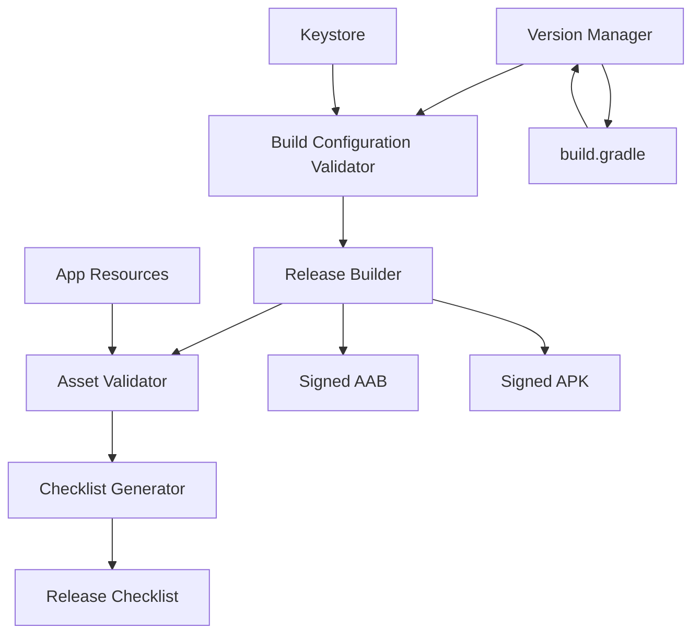

# Design Document: Play Store Release Automation

## Overview

This design describes a comprehensive system for automating the Android app version update and Play Store release preparation process for BillByteKOT. The system provides automated version management, build generation, asset validation, and release checklist generation to streamline the Play Store submission workflow.

The solution consists of modular components that handle version incrementation, build configuration validation, release artifact generation, and Play Store asset verification. The design emphasizes automation, validation, and clear error reporting to minimize manual errors and submission rejections.

## Architecture

The system follows a pipeline architecture with distinct stages:

1. **Version Management Stage**: Increments version numbers and updates build configuration
2. **Validation Stage**: Verifies build configuration, signing setup, and TWA settings
3. **Build Stage**: Generates signed APK and AAB artifacts
4. **Asset Validation Stage**: Verifies Play Store assets and requirements
5. **Checklist Generation Stage**: Produces a comprehensive release checklist

Each stage can be executed independently or as part of a complete release pipeline. The design uses a command-line interface approach with clear output and error reporting.

### Component Diagram



## Components and Interfaces

### 1. Version Manager

**Purpose**: Manages version code and version name incrementation in build.gradle

**Interface**:
```python
class VersionManager:
    def get_current_version() -> tuple[int, str]:
        """Returns (versionCode, versionName) from build.gradle"""
        
    def increment_version() -> tuple[int, str]:
        """Increments versionCode by 1, updates versionName to match"""
        
    def update_build_gradle(version_code: int, version_name: str) -> bool:
        """Updates build.gradle with new version values"""
        
    def validate_version(version_code: int) -> bool:
        """Validates that version code is positive and greater than current"""
        
    def record_version_change(old_version: int, new_version: int) -> None:
        """Records version change in version history log"""
```

**Implementation Details**:
- Parses build.gradle using regex to locate versionCode and versionName
- Preserves all formatting and comments in build.gradle
- Creates backup of build.gradle before modification
- Maintains version_history.log with timestamps and version changes
- Validates version numbers before writing to file

### 2. Build Configuration Validator

**Purpose**: Validates build configuration and signing setup before building

**Interface**:
```python
class BuildConfigValidator:
    def validate_signing_config() -> ValidationResult:
        """Verifies keystore exists and signing is configured"""
        
    def validate_sdk_versions() -> ValidationResult:
        """Checks targetSdk and minSdk meet requirements"""
        
    def validate_twa_config() -> ValidationResult:
        """Validates TWA-specific settings (hostName, launchUrl, assetlinks)"""
        
    def validate_all() -> list[ValidationResult]:
        """Runs all validations and returns results"""
```

**Validation Checks**:
- Keystore file exists at expected path (android.keystore)
- targetSdkVersion >= 33 (Play Store requirement as of 2024)
- minSdkVersion is reasonable (currently 21)
- TWA hostName matches production domain
- assetlinks.json exists and is valid JSON
- Digital Asset Links verification (optional, requires network)

### 3. Release Builder

**Purpose**: Generates signed APK and AAB files for distribution

**Interface**:
```python
class ReleaseBuilder:
    def build_aab(keystore_path: str, key_alias: str, passwords: dict) -> BuildResult:
        """Builds signed Android App Bundle"""
        
    def build_apk(keystore_path: str, key_alias: str, passwords: dict) -> BuildResult:
        """Builds signed APK"""
        
    def verify_build_output(file_path: str) -> bool:
        """Verifies build artifact is valid and properly signed"""
        
    def get_build_info(file_path: str) -> dict:
        """Extracts version, package name, and signing info from artifact"""
```

**Build Process**:
1. Clean previous build artifacts
2. Execute Gradle assembleRelease for APK
3. Execute Gradle bundleRelease for AAB
4. Sign artifacts using jarsigner or apksigner
5. Verify signatures and extract build information
6. Move artifacts to release output directory

**Output Location**: `frontend/billbytekot/release/v{version}/`

### 4. Asset Validator

**Purpose**: Validates Play Store assets and app resources

**Interface**:
```python
class AssetValidator:
    def validate_launcher_icons() -> ValidationResult:
        """Checks all required icon densities exist"""
        
    def validate_adaptive_icons() -> ValidationResult:
        """Verifies adaptive icon configuration"""
        
    def validate_feature_graphic() -> ValidationResult:
        """Checks for 1024x500 feature graphic"""
        
    def validate_screenshots() -> ValidationResult:
        """Verifies screenshot requirements"""
        
    def generate_asset_checklist() -> list[str]:
        """Returns list of missing or invalid assets"""
```

**Icon Requirements**:
- Launcher icons in: mdpi (48x48), hdpi (72x72), xhdpi (96x96), xxhdpi (144x144), xxxhdpi (192x192)
- Adaptive icons: foreground and background layers in mipmap-anydpi-v26
- All icons must be PNG format
- No transparency in launcher icons (adaptive icons can have transparency in foreground)

**Play Store Assets** (not in app, but validated via checklist):
- Feature graphic: 1024x500 PNG or JPG
- Screenshots: Minimum 2, maximum 8 per device type
- App icon: 512x512 PNG (32-bit with alpha)
- Privacy policy URL (if app handles sensitive data)

### 5. Checklist Generator

**Purpose**: Generates comprehensive release checklist

**Interface**:
```python
class ChecklistGenerator:
    def generate_checklist(validation_results: dict) -> str:
        """Generates markdown checklist based on validation results"""
        
    def add_manual_steps() -> list[str]:
        """Returns list of manual steps for Play Console"""
        
    def save_checklist(output_path: str) -> None:
        """Saves checklist to file"""
```

**Checklist Sections**:
1. Pre-build validation (version, config, signing)
2. Build generation (AAB, APK)
3. Build verification (signatures, version info)
4. Asset validation (icons, graphics)
5. Play Console steps (upload, release notes, rollout)

### 6. Manifest Validator

**Purpose**: Validates AndroidManifest.xml for Play Store compliance and modern Android compatibility

**Interface**:
```python
class ManifestValidator:
    def validate_edge_to_edge_config() -> ValidationResult:
        """Checks for deprecated edge-to-edge parameters"""
        
    def validate_large_screen_support() -> ValidationResult:
        """Verifies large screen and resizability configuration"""
        
    def validate_orientation_config() -> ValidationResult:
        """Checks for fixed orientation restrictions"""
        
    def scan_deprecated_attributes() -> list[DeprecatedAttribute]:
        """Scans manifest for all deprecated attributes"""
        
    def generate_migration_report() -> str:
        """Generates detailed migration guide for found issues"""
```

**Validation Checks**:
- Deprecated edge-to-edge attributes in `<application>` or `<activity>` tags
- `resizeableActivity="false"` restrictions
- Fixed `screenOrientation` values (portrait, landscape, etc.)
- Missing large screen support declarations
- Deprecated window configuration parameters

**Remediation Actions**:
- Remove deprecated edge-to-edge parameters
- Remove or update resizeableActivity restrictions
- Remove fixed orientation locks or make them conditional
- Add large screen support declarations
- Provide code snippets for modern alternatives

## Data Models

### ValidationResult

```python
@dataclass
class ValidationResult:
    check_name: str
    passed: bool
    message: str
    severity: str  # "error", "warning", "info"
    remediation: str | None  # How to fix if failed
```

### BuildResult

```python
@dataclass
class BuildResult:
    success: bool
    artifact_path: str | None
    file_size: int | None
    version_code: int | None
    version_name: str | None
    package_name: str | None
    error_message: str | None
```

### VersionInfo

```python
@dataclass
class VersionInfo:
    version_code: int
    version_name: str
    timestamp: str
    previous_version_code: int | None
```

### DeprecatedAttribute

```python
@dataclass
class DeprecatedAttribute:
    attribute_name: str
    element_tag: str
    line_number: int
    current_value: str
    reason: str  # Why it's deprecated
    migration_guide: str  # How to fix it
    severity: str  # "error", "warning"
```

### ManifestIssue

```python
@dataclass
class ManifestIssue:
    issue_type: str  # "edge-to-edge", "resizability", "orientation"
    description: str
    location: str  # File path and line number
    current_config: str
    recommended_config: str
    play_store_impact: str  # How this affects Play Store submission
```

## Correctness Properties


A property is a characteristic or behavior that should hold true across all valid executions of a system - essentially, a formal statement about what the system should do. Properties serve as the bridge between human-readable specifications and machine-verifiable correctness guarantees.

### Property Reflection

After analyzing all acceptance criteria, several properties can be consolidated:
- Properties 3.1 and 3.2 (AAB and APK generation) can be combined into a single property about artifact generation
- Properties 7.1 and 7.2 (file size validation) can be combined into a single property
- Properties 8.2, 8.3, 8.4, 8.5 (checklist content) can be combined into a comprehensive checklist completeness property
- Properties 4.1, 4.2, 4.3 (icon validation) can be combined into a comprehensive icon validation property

### Core Properties

Property 1: Version Increment Consistency
*For any* current version code, incrementing the version should produce a new version code that is exactly one greater than the current version, and the version name should match the new version code.
**Validates: Requirements 1.1, 1.2**

Property 2: Build Configuration Persistence (Round Trip)
*For any* valid build.gradle file, updating version values then reading the file should return the exact version values that were written, and all non-version configuration should remain unchanged.
**Validates: Requirements 1.3, 1.4**

Property 3: Version Validation
*For any* version code value, the Version_Manager should reject version codes that are not positive integers or are not greater than the current version.
**Validates: Requirements 1.5**

Property 4: Signing Configuration Validation
*For any* build configuration, validation should fail if the keystore file does not exist or if the signing configuration is incomplete, and should provide specific error messages with remediation guidance.
**Validates: Requirements 2.1, 2.2, 2.5**

Property 5: SDK Version Requirements
*For any* build configuration, validation should fail if targetSdkVersion is below Play Store minimum requirements (currently 33).
**Validates: Requirements 2.3**

Property 6: Release Artifact Generation
*For any* valid build configuration with proper signing, the Release_Builder should generate both a signed AAB and signed APK file in predictable output locations, and both files should be properly signed and have reasonable file sizes.
**Validates: Requirements 3.1, 3.2, 3.4, 3.5, 7.1, 7.2**

Property 7: Minification Application
*For any* build configuration where minifyEnabled is true, the generated artifacts should be smaller than unminified builds and should have obfuscated code.
**Validates: Requirements 3.3**

Property 8: Build Artifact Consistency
*For any* generated build artifact (APK or AAB), the version code, version name, and application ID extracted from the artifact should exactly match the values in build.gradle.
**Validates: Requirements 7.3, 7.4**

Property 9: Comprehensive Icon Validation
*For any* app resource directory, the Asset_Validator should verify that launcher icons exist in all required density folders (mdpi, hdpi, xhdpi, xxhdpi, xxxhdpi), adaptive icons are properly configured with foreground and background layers, and all icon dimensions match Play Store requirements for each density. When validation fails, it should report which specific densities or formats are missing.
**Validates: Requirements 4.1, 4.2, 4.3, 4.4, 4.5**

Property 10: Asset Completeness Validation
*For any* set of Play Store assets, the Asset_Validator should verify that all required assets exist (feature graphic, screenshots, descriptions) and meet requirements (dimensions, character limits), and should generate a complete checklist of any missing items.
**Validates: Requirements 5.2, 5.4, 5.5**

Property 11: Signing Security
*For any* signing operation or validation, the system should never log or expose sensitive credential information (passwords, key material) in any output, logs, or error messages.
**Validates: Requirements 6.5**

Property 12: Signing Configuration Completeness
*For any* signing configuration, validation should verify that the keystore file exists, key alias is configured, and credentials are available, providing clear error messages when any component is missing.
**Validates: Requirements 6.1, 6.2, 6.3, 6.4**

Property 13: Comprehensive Release Checklist
*For any* release preparation, the generated checklist should include all required sections: version verification, build generation steps, asset validation steps, and Play Store submission steps with links to Play Console.
**Validates: Requirements 8.1, 8.2, 8.3, 8.4, 8.5**

Property 14: TWA Configuration Validation
*For any* TWA configuration, the Build_System should verify that assetlinks.json is valid JSON and properly configured, hostName matches the production domain, and launchUrl points to the correct PWA entry point, reporting specific configuration errors when validation fails.
**Validates: Requirements 9.1, 9.2, 9.3, 9.4**

Property 15: Version History Logging
*For any* version increment operation, the Version_Manager should record the change in a version history log with timestamp, previous version code, and new version code.
**Validates: Requirements 10.1, 10.2, 10.3**

Property 16: Version Query Idempotence
*For any* version query operation, reading the current version multiple times should return the same result and should not modify any files or state.
**Validates: Requirements 10.4**

Property 17: Version Rollback Round Trip
*For any* version increment followed by rollback, the final version should match the original version before the increment.
**Validates: Requirements 10.5**

Property 18: Edge-to-Edge API Modernization
*For any* AndroidManifest.xml file, the validator should detect deprecated edge-to-edge parameters and flag them for removal, ensuring only modern edge-to-edge APIs are used.
**Validates: Requirements 11.2, 11.4, 11.5**

Property 19: Large Screen Resizability
*For any* AndroidManifest.xml file, the validator should detect resizability restrictions (resizeableActivity="false") and flag them, ensuring the app can resize on large screen devices.
**Validates: Requirements 12.1, 12.4**

Property 20: Orientation Flexibility
*For any* AndroidManifest.xml file, the validator should detect fixed orientation locks (screenOrientation with fixed values) and flag them, ensuring the app supports device rotation.
**Validates: Requirements 12.2, 12.4**

Property 21: Manifest Validation Completeness
*For any* AndroidManifest.xml file, the validator should scan for all deprecated attributes, resizability restrictions, and orientation locks, generating a complete report with file locations and remediation steps for each issue found.
**Validates: Requirements 13.1, 13.2, 13.3, 13.4, 13.5**

## Error Handling

### Error Categories

1. **Configuration Errors**: Invalid build.gradle, missing signing config, incorrect TWA settings
2. **File System Errors**: Missing keystore, inaccessible resources, permission issues
3. **Build Errors**: Gradle build failures, signing failures, artifact generation issues
4. **Validation Errors**: Invalid assets, incorrect dimensions, missing required files
5. **Version Errors**: Invalid version numbers, version conflicts
6. **Manifest Errors**: Deprecated attributes, resizability restrictions, orientation locks
7. **Compatibility Errors**: Edge-to-edge API issues, large screen support problems

### Error Handling Strategy

**Fail Fast**: Validate all prerequisites before starting builds to catch errors early

**Clear Messages**: Every error should include:
- What went wrong (specific error)
- Why it matters (impact)
- How to fix it (remediation steps)

**Graceful Degradation**: Some validations (like Digital Asset Links verification) can be warnings rather than hard failures

**Rollback Support**: Version changes should be reversible if issues are discovered

### Example Error Messages

```
ERROR: Keystore not found
  Location: frontend/billbytekot/android.keystore
  Impact: Cannot sign release builds
  Fix: Ensure keystore file exists at the expected path or update signing configuration

WARNING: Feature graphic not found
  Location: Play Console assets
  Impact: Cannot complete Play Store listing
  Fix: Create a 1024x500 PNG feature graphic and upload to Play Console

ERROR: targetSdkVersion too low
  Current: 31
  Required: 33
  Impact: Play Store will reject submission
  Fix: Update targetSdkVersion to 33 or higher in build.gradle

WARNING: Deprecated edge-to-edge parameter detected
  Location: AndroidManifest.xml, line 15
  Parameter: android:windowLayoutInDisplayCutoutMode
  Impact: Play Store warning about deprecated APIs
  Fix: Remove this parameter and use WindowCompat.setDecorFitsSystemWindows() in code instead

ERROR: Resizability restriction detected
  Location: AndroidManifest.xml, line 22
  Current: resizeableActivity="false"
  Impact: App won't work properly on tablets, foldables, and ChromeOS
  Fix: Remove resizeableActivity attribute or set to "true"

WARNING: Fixed orientation lock detected
  Location: AndroidManifest.xml, line 23
  Current: screenOrientation="portrait"
  Impact: Poor user experience on large screens and tablets
  Fix: Remove screenOrientation or use "unspecified" for flexible orientation
```

## Testing Strategy

### Dual Testing Approach

This system requires both unit tests and property-based tests for comprehensive coverage:

**Unit Tests** focus on:
- Specific examples of version increments (28 → 29)
- Edge cases (version 1, very large version numbers)
- Error conditions (missing files, invalid JSON)
- Integration between components

**Property-Based Tests** focus on:
- Universal properties that hold for all inputs
- Version increment consistency across any starting version
- File parsing and writing round-trip properties
- Validation logic across various configurations

### Property-Based Testing Configuration

We will use **Hypothesis** (Python) for property-based testing with the following configuration:
- Minimum 100 iterations per property test
- Each test tagged with: **Feature: play-store-release, Property {N}: {property_text}**
- Custom generators for version numbers, file paths, and configuration objects

### Test Organization

```
tests/
├── unit/
│   ├── test_version_manager.py
│   ├── test_build_validator.py
│   ├── test_release_builder.py
│   ├── test_asset_validator.py
│   └── test_checklist_generator.py
├── property/
│   ├── test_version_properties.py
│   ├── test_build_properties.py
│   ├── test_asset_properties.py
│   └── test_integration_properties.py
└── integration/
    ├── test_full_release_pipeline.py
    └── test_error_scenarios.py
```

### Key Test Scenarios

**Unit Test Examples**:
- Test version increment from 28 to 29
- Test build.gradle parsing with various formatting
- Test keystore validation with missing file
- Test icon dimension validation for specific sizes
- Test checklist generation with missing assets

**Property Test Examples**:
- For any version N, increment produces N+1
- For any build.gradle content, parse then write produces equivalent file
- For any icon set, validation correctly identifies missing densities
- For any TWA config, validation catches domain mismatches
- For any version history, rollback then increment restores state
- For any AndroidManifest.xml, validator detects all deprecated attributes
- For any manifest with resizability restrictions, validator flags them correctly

### Integration Testing

Full pipeline tests that:
1. Start with version 28
2. Increment to version 29
3. Validate configuration
4. Validate AndroidManifest.xml for compatibility issues
5. Generate builds (mocked signing)
6. Validate assets
7. Generate checklist
8. Verify all artifacts and logs

### Manual Testing Checklist

Some aspects require manual verification:
- [ ] Generated APK installs correctly on test device
- [ ] Generated AAB uploads successfully to Play Console
- [ ] App icon appears correctly on launcher
- [ ] TWA opens correct URL
- [ ] Digital Asset Links work (app opens from web links)
- [ ] Play Store listing displays correctly
- [ ] App displays correctly with edge-to-edge on Android 15+
- [ ] App resizes properly on tablets and foldables
- [ ] App rotates correctly on large screen devices
- [ ] No Play Store warnings about deprecated APIs or compatibility

## Implementation Notes

### Technology Stack

- **Language**: Python 3.10+ (for automation scripts)
- **Build System**: Gradle (existing Android build system)
- **Testing**: pytest + Hypothesis (property-based testing)
- **File Parsing**: Regular expressions for build.gradle, JSON for assetlinks
- **Signing**: Android SDK tools (apksigner, jarsigner)

### File Locations

```
frontend/billbytekot/
├── app/
│   ├── build.gradle          # Version configuration
│   ├── src/main/
│   │   ├── AndroidManifest.xml  # Manifest configuration
│   │   └── res/              # App resources and icons
├── android.keystore          # Signing keystore
├── assetlinks.json           # Digital Asset Links
├── release/                  # Build output directory
│   └── v{version}/
│       ├── app-release.aab
│       ├── app-release.apk
│       ├── build-info.json
│       └── manifest-validation.json
└── scripts/
    ├── version_manager.py
    ├── build_validator.py
    ├── manifest_validator.py    # NEW: Manifest validation
    ├── release_builder.py
    ├── asset_validator.py
    └── release.py            # Main orchestration script
```

### Environment Variables

```bash
KEYSTORE_PASSWORD=<keystore_password>
KEY_PASSWORD=<key_password>
KEY_ALIAS=<key_alias>
```

### Command-Line Interface

```bash
# Check current version
python scripts/release.py version

# Increment version
python scripts/release.py increment

# Validate configuration
python scripts/release.py validate

# Validate AndroidManifest.xml for compatibility
python scripts/release.py validate-manifest

# Build release artifacts
python scripts/release.py build

# Full release pipeline
python scripts/release.py release --validate --build --checklist

# Rollback version
python scripts/release.py rollback
```

### Security Considerations

1. **Keystore Protection**: Never commit keystore to version control
2. **Credential Management**: Use environment variables or secure secret storage
3. **Log Sanitization**: Ensure no passwords appear in logs or output
4. **File Permissions**: Restrict access to keystore and credential files
5. **Build Verification**: Always verify signatures before distribution

### Play Store Submission Workflow

After running the automation:

1. **Upload AAB**: Go to Play Console → Release → Production → Create new release
2. **Add Release Notes**: Describe changes in this version
3. **Review**: Check all warnings and errors
4. **Rollout**: Start with staged rollout (e.g., 10% of users)
5. **Monitor**: Watch crash reports and user feedback
6. **Increase Rollout**: Gradually increase to 100%

### Maintenance Considerations

- Update targetSdkVersion annually to meet Play Store requirements
- Review and update icon assets when design changes
- Keep signing keystore backed up securely
- Maintain version history log for audit trail
- Update automation scripts when Gradle or Android SDK changes
- Monitor Play Store policy updates for new compatibility requirements
- Test on latest Android versions and large screen devices
- Keep AndroidManifest.xml updated with modern best practices

## Android Compatibility Implementation Guide

### Edge-to-Edge Display

For TWA apps, edge-to-edge is primarily handled by the web content. However, the manifest should not contain deprecated parameters:

**Remove these deprecated attributes from AndroidManifest.xml:**
- `android:windowLayoutInDisplayCutoutMode` (use modern alternatives)
- Any deprecated window configuration parameters

**Modern approach:**
- Let the web content handle edge-to-edge with CSS (viewport-fit=cover)
- Use modern Android 15+ edge-to-edge APIs if custom native UI is needed

### Large Screen Support

**Remove resizability restrictions:**
```xml
<!-- REMOVE or set to true -->
<activity
    android:name=".LauncherActivity"
    android:resizeableActivity="false">  <!-- REMOVE THIS -->
</activity>
```

**Remove orientation locks:**
```xml
<!-- REMOVE fixed orientations -->
<activity
    android:name=".LauncherActivity"
    android:screenOrientation="portrait">  <!-- REMOVE THIS -->
</activity>
```

**Add large screen support declarations:**
```xml
<supports-screens
    android:smallScreens="true"
    android:normalScreens="true"
    android:largeScreens="true"
    android:xlargeScreens="true"
    android:anyDensity="true" />
```

### Validation Workflow

1. **Pre-build validation**: Check manifest for deprecated attributes
2. **Automated fixes**: Script can automatically remove problematic attributes
3. **Manual review**: Developer reviews changes before committing
4. **Build and test**: Generate APK/AAB and test on various devices
5. **Play Store submission**: Upload with confidence that warnings are resolved
