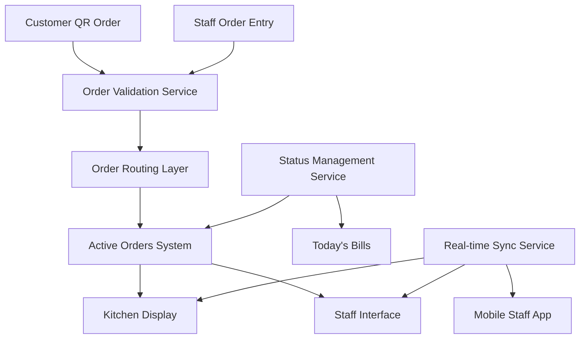

# Design Document: QR Order Workflow Fix

## Overview

This design addresses the critical workflow issue where QR code orders bypass the Active Orders system and go directly to Today's Bills. The solution involves modifying the order routing logic, implementing proper status management, and ensuring real-time synchronization across all restaurant systems.

The core problem is in the order creation flow where QR orders are being marked as completed immediately upon placement, rather than following the standard order lifecycle. This design establishes a unified order processing pipeline that treats QR orders identically to staff-entered orders.

## Architecture

The solution involves three main architectural changes:

1. **Order Routing Layer**: Centralized order processing that routes all orders through the same pipeline
2. **Status Management Service**: Unified order status tracking across all order sources
3. **Real-time Synchronization**: Event-driven updates to keep all systems in sync



## Components and Interfaces

### Order Processing Pipeline

**OrderProcessor Interface**:
```typescript
interface OrderProcessor {
  processOrder(order: Order, source: OrderSource): Promise<ProcessedOrder>
  validateOrder(order: Order): ValidationResult
  routeOrder(order: ProcessedOrder): Promise<void>
}
```

**Order Model**:
```typescript
interface Order {
  id: string
  tableNumber: string
  items: OrderItem[]
  source: OrderSource // 'QR' | 'STAFF' | 'PHONE'
  status: OrderStatus
  timestamps: OrderTimestamps
  metadata: OrderMetadata
}

interface OrderStatus {
  current: 'pending' | 'active' | 'preparing' | 'ready' | 'completed'
  history: StatusChange[]
}
```

### Status Management Service

**StatusManager Interface**:
```typescript
interface StatusManager {
  updateOrderStatus(orderId: string, newStatus: OrderStatus): Promise<void>
  getOrderStatus(orderId: string): Promise<OrderStatus>
  subscribeToStatusChanges(callback: StatusChangeCallback): void
}
```

The StatusManager ensures that all status changes follow business rules and trigger appropriate notifications to connected systems.

### Real-time Synchronization

**SyncService Interface**:
```typescript
interface SyncService {
  broadcastOrderUpdate(order: Order): Promise<void>
  subscribeToUpdates(systemId: string, callback: UpdateCallback): void
  handleConnectionLoss(): void
  resyncOnReconnect(): Promise<void>
}
```

## Data Models

### Core Order Structure

```typescript
interface ProcessedOrder extends Order {
  validationStatus: 'valid' | 'invalid' | 'warning'
  routingDestination: 'active_orders' | 'hold' | 'reject'
  processingTimestamp: Date
}

interface OrderTimestamps {
  placed: Date
  received: Date
  started?: Date
  ready?: Date
  completed?: Date
}

interface OrderMetadata {
  customerInfo?: CustomerInfo
  specialInstructions?: string
  estimatedPrepTime?: number
  priority: 'normal' | 'high' | 'rush'
}
```

### Status Change Tracking

```typescript
interface StatusChange {
  from: OrderStatus['current']
  to: OrderStatus['current']
  timestamp: Date
  triggeredBy: 'system' | 'staff' | 'customer'
  staffId?: string
}
```

## Correctness Properties

*A property is a characteristic or behavior that should hold true across all valid executions of a system—essentially, a formal statement about what the system should do. Properties serve as the bridge between human-readable specifications and machine-verifiable correctness guarantees.*

Before defining the correctness properties, let me analyze the acceptance criteria to determine which are testable as properties.

### Property 1: QR Order Routing Consistency
*For any* QR order placed by a customer, the order should be routed to Active_Orders with an initial status of "pending" and should never be automatically marked as "completed" upon placement.
**Validates: Requirements 1.1, 1.2, 1.3**

### Property 2: Order Source Equality
*For any* order processing operation (status updates, modifications, display), QR orders and staff-entered orders should be processed identically with the same priority and capabilities.
**Validates: Requirements 1.4, 3.2**

### Property 3: Real-time Display Updates
*For any* QR order entering Active_Orders or changing status, the Kitchen_Display should show the complete order information within 5 seconds and reflect all subsequent status changes in real-time.
**Validates: Requirements 2.1, 2.2, 2.4**

### Property 4: Order Status Lifecycle
*For any* order (QR or staff-entered), status transitions should follow the sequence: pending → preparing → ready → completed, with each transition properly recorded and triggering appropriate system updates.
**Validates: Requirements 4.1, 4.2, 4.3, 4.4**

### Property 5: Completion Workflow
*For any* order marked as "completed", the system should automatically move it from Active_Orders to Today_Bills while preserving all order data and history.
**Validates: Requirements 3.4, 4.5**

### Property 6: Staff Interface Integration
*For any* QR order, the Staff_Interface should display it alongside regular orders, allow all modification operations (add items, change quantities, add notes), and clearly indicate the order source.
**Validates: Requirements 3.1, 3.3, 3.5**

### Property 7: System Synchronization
*For any* QR order data change, all connected systems (Kitchen_Display, Staff_Interface, Mobile_App) should receive synchronized updates and maintain consistent information across concurrent access.
**Validates: Requirements 5.2, 5.4**

### Property 8: Network Resilience
*For any* network interruption during QR order processing, the system should handle the interruption gracefully and synchronize all pending changes when connection is restored.
**Validates: Requirements 5.3**

### Property 9: Order Validation
*For any* QR order submission, the system should validate all order data before routing to Active_Orders, and if validation fails, should log errors and notify staff without corrupting the order flow.
**Validates: Requirements 6.1, 6.3**

### Property 10: Duplicate Prevention
*For any* table attempting to place multiple orders, the system should prevent duplicate orders from the same table within a 5-minute window while allowing legitimate subsequent orders.
**Validates: Requirements 6.4**

### Property 11: Data Integrity Preservation
*For any* order movement between systems or status changes, all order metadata, timestamps, and referential integrity should be preserved without data loss or corruption.
**Validates: Requirements 4.6, 6.2, 6.5**

### Property 12: Response Time Compliance
*For any* QR order submission, the system should notify Active_Orders within 3 seconds to ensure timely kitchen workflow integration.
**Validates: Requirements 5.1**

## Error Handling

The system must handle several error scenarios gracefully:

### Order Processing Errors
- **Invalid Order Data**: Validate all incoming QR orders and reject malformed requests with clear error messages
- **System Unavailability**: Queue orders locally when Active_Orders system is temporarily unavailable
- **Duplicate Detection**: Prevent duplicate orders while allowing legitimate reorders after the time window

### Network and Connectivity Issues
- **Connection Loss**: Maintain local order state and sync when connectivity is restored
- **Partial Sync Failures**: Retry failed synchronization attempts with exponential backoff
- **System Overload**: Implement rate limiting and graceful degradation during peak periods

### Data Consistency Errors
- **Status Conflicts**: Resolve conflicting status updates using timestamp-based conflict resolution
- **Missing References**: Handle cases where orders reference non-existent tables or menu items
- **Corrupted Data**: Detect and recover from data corruption using checksums and validation

## Testing Strategy

The testing approach combines unit tests for specific scenarios with property-based tests for comprehensive coverage of the order workflow fix.

### Unit Testing Focus
- **Integration Points**: Test connections between QR system, Active_Orders, and Kitchen_Display
- **Error Scenarios**: Validate error handling for network failures, invalid data, and system overload
- **Edge Cases**: Test boundary conditions like exactly 5-minute duplicate windows and 3-second timing requirements
- **Status Transitions**: Verify each specific status change scenario with concrete examples

### Property-Based Testing Configuration
- **Framework**: Use fast-check (JavaScript/TypeScript) or Hypothesis (Python) for property testing
- **Test Iterations**: Minimum 100 iterations per property test to ensure comprehensive input coverage
- **Order Generation**: Generate random orders with varying complexity, table numbers, and timing
- **System State**: Test properties across different system states (busy periods, network issues, etc.)

### Property Test Implementation
Each correctness property will be implemented as a property-based test with the following configuration:
- **Minimum 100 iterations** per test to handle randomization effectively
- **Tagged with feature reference**: `Feature: qr-order-workflow-fix, Property N: [property description]`
- **Comprehensive input generation**: Random orders, timing variations, and system states
- **Assertion verification**: Each property maps directly to measurable system behavior

The dual testing approach ensures both specific workflow scenarios work correctly (unit tests) and the general order processing behavior is robust across all possible inputs (property tests).