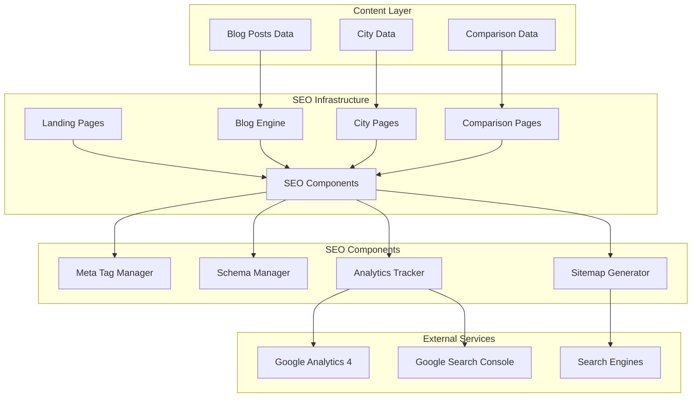

# Design Document: SEO Enhancement for BillByteKOT

## Overview

This design document outlines the technical implementation for a comprehensive SEO enhancement strategy to help BillByteKOT outrank competitors (Petpooja, POSist) and achieve top search rankings for restaurant billing software keywords in India. The implementation focuses on on-page SEO, technical SEO, content strategy, and structured data optimization.

## Architecture



## Components and Interfaces

### 1. SEO Meta Component (`frontend/src/components/seo/SEOMeta.js`)

Reusable component for managing page-level SEO meta tags.

```javascript
// Interface
interface SEOMetaProps {
  title: string;           // Page title (max 60 chars)
  description: string;     // Meta description (max 155 chars)
  keywords: string[];      // Target keywords
  canonicalUrl: string;    // Canonical URL
  ogImage?: string;        // Open Graph image
  ogType?: string;         // og:type (website, article, product)
  author?: string;         // Content author
  publishedDate?: string;  // Article publish date
  modifiedDate?: string;   // Last modified date
  noIndex?: boolean;       // Prevent indexing
}
```

### 2. Schema Manager Component (`frontend/src/components/seo/SchemaManager.js`)

Manages structured data (JSON-LD) for rich snippets.

```javascript
// Interface
interface SchemaManagerProps {
  type: 'SoftwareApplication' | 'Organization' | 'FAQPage' | 
        'Article' | 'BreadcrumbList' | 'LocalBusiness' | 'Product';
  data: SchemaData;
}

interface SoftwareApplicationSchema {
  name: string;
  description: string;
  applicationCategory: string;
  operatingSystem: string;
  offers: OfferSchema;
  aggregateRating: RatingSchema;
  featureList: string[];
}

interface FAQSchema {
  questions: Array<{
    question: string;
    answer: string;
  }>;
}
```

### 3. Blog Post Component (`frontend/src/pages/BlogPostPage.js`)

Enhanced blog post page with full SEO optimization.

```javascript
// Interface
interface BlogPost {
  id: number;
  slug: string;
  title: string;
  excerpt: string;
  content: string;
  author: AuthorInfo;
  date: string;
  lastModified: string;
  readTime: string;
  category: string;
  tags: string[];
  keywords: string[];
  image: string;
  imageAlt: string;
  featured: boolean;
  relatedPosts: number[];
}

interface AuthorInfo {
  name: string;
  bio: string;
  avatar: string;
  social: {
    twitter?: string;
    linkedin?: string;
  };
}
```

### 4. City Landing Page Component (`frontend/src/pages/CityLandingPage.js`)

Dynamic city-specific landing pages for local SEO.

```javascript
// Interface
interface CityPageProps {
  city: string;
  state: string;
  keywords: string[];
  testimonials: Testimonial[];
  localStats: LocalStats;
}

interface LocalStats {
  restaurantCount: number;
  averageRating: number;
  topCuisines: string[];
}
```

### 5. Sitemap Generator (`frontend/src/utils/sitemapGenerator.js`)

Automated sitemap generation for all pages.

```javascript
// Interface
interface SitemapEntry {
  loc: string;
  lastmod: string;
  changefreq: 'always' | 'hourly' | 'daily' | 'weekly' | 'monthly' | 'yearly' | 'never';
  priority: number; // 0.0 to 1.0
}

interface SitemapConfig {
  baseUrl: string;
  pages: SitemapEntry[];
  blogPosts: BlogPost[];
  cityPages: string[];
}
```

## Data Models

### Blog Posts Data Structure (`frontend/src/data/blogPosts.js`)

```javascript
// Extended blog post structure
const blogPost = {
  id: 1,
  slug: "best-restaurant-billing-software-india-2025",
  title: "Best Restaurant Billing Software India 2025 - Complete Guide",
  metaTitle: "Best Restaurant Billing Software India 2025 | Free Trial - BillByteKOT",
  metaDescription: "Compare top restaurant billing software in India. BillByteKOT offers KOT system, thermal printing, WhatsApp integration at ₹1999/year. 7-day free trial!",
  excerpt: "Looking for the best restaurant billing software in India?...",
  content: "# Full markdown content...",
  author: {
    name: "BillByteKOT Team",
    bio: "Restaurant technology experts with 10+ years experience",
    avatar: "/images/authors/team.jpg"
  },
  date: "2025-01-15",
  lastModified: "2025-01-15",
  readTime: "12 min read",
  category: "Software Guide",
  tags: ["restaurant billing", "POS software", "India"],
  keywords: [
    "restaurant billing software",
    "best restaurant billing software India",
    "restaurant POS software",
    "billing software for restaurant"
  ],
  image: "https://images.unsplash.com/photo-xxx",
  imageAlt: "Restaurant billing software dashboard showing KOT system",
  featured: true,
  relatedPosts: [2, 3, 5],
  schema: {
    type: "Article",
    wordCount: 2500
  }
};
```

### City Data Structure (`frontend/src/data/cityData.js`)

```javascript
const cityData = {
  mumbai: {
    name: "Mumbai",
    state: "Maharashtra",
    slug: "restaurant-billing-software-mumbai",
    title: "Best Restaurant Billing Software Mumbai 2025 | BillByteKOT",
    description: "Top restaurant billing software for Mumbai restaurants. KOT system, GST billing, WhatsApp integration. Trusted by 100+ Mumbai restaurants.",
    keywords: [
      "restaurant billing software Mumbai",
      "restaurant POS Mumbai",
      "billing software Mumbai restaurants"
    ],
    stats: {
      restaurantCount: 150,
      averageRating: 4.9,
      topCuisines: ["Indian", "Chinese", "Continental", "Street Food"]
    },
    testimonials: [
      {
        name: "Rajesh Sharma",
        restaurant: "Spice Garden, Andheri",
        quote: "BillByteKOT transformed our restaurant operations!",
        rating: 5
      }
    ],
    localFeatures: [
      "GST compliant for Maharashtra",
      "Multi-language support (Marathi, Hindi, English)",
      "Local payment integrations"
    ]
  }
  // ... 19 more cities
};
```

### FAQ Data Structure (`frontend/src/data/faqData.js`)

```javascript
const faqData = [
  {
    id: 1,
    question: "What is the best restaurant billing software in India 2025?",
    answer: "BillByteKOT is rated as the best restaurant billing software in India for 2025. It offers comprehensive features including KOT system, thermal printing with 6 themes, WhatsApp integration, inventory management, and GST billing at just ₹1999/year - making it more affordable than competitors like Petpooja while offering superior features.",
    keywords: ["best restaurant billing software India", "restaurant software 2025"],
    category: "General"
  },
  {
    id: 2,
    question: "Is BillByteKOT better than Petpooja?",
    answer: "Yes, BillByteKOT offers several advantages over Petpooja: 1) More affordable pricing at ₹1999/year vs Petpooja's ₹12,000+, 2) AI-powered recommendations, 3) 6 professional thermal receipt themes, 4) WhatsApp Cloud API integration, 5) Offline mode support, 6) Free 7-day trial.",
    keywords: ["billbytekot vs petpooja", "petpooja alternative"],
    category: "Comparison"
  }
  // ... 20+ more FAQs
];
```


## Correctness Properties

*A property is a characteristic or behavior that should hold true across all valid executions of a system-essentially, a formal statement about what the system should do. Properties serve as the bridge between human-readable specifications and machine-verifiable correctness guarantees.*


Based on the prework analysis, the following testable properties have been identified:

### Property 1: Blog Post Data Completeness

*For any* blog post in the blog posts collection, the post SHALL contain all required SEO fields: title (max 60 chars), metaDescription (max 155 chars), slug (unique), author, date, lastModified, readTime, category (from valid list), keywords array, image, and imageAlt.

**Validates: Requirements 2.2, 2.4, 9.1**

### Property 2: Blog Post Slug Uniqueness

*For any* collection of blog posts, all slugs SHALL be unique - no two blog posts can have the same slug value.

**Validates: Requirements 2.5**

### Property 3: Blog Post Category Validity

*For any* blog post, the category field SHALL be one of the valid categories: "Software Guide", "Comparison", "How-To", "Industry News", "Case Studies", "City Guides", "Restaurant Tips", "Technology".

**Validates: Requirements 2.3**

### Property 4: Schema JSON-LD Validity

*For any* schema type (SoftwareApplication, Organization, FAQPage, Article, BreadcrumbList, LocalBusiness, Product), the generated JSON-LD SHALL be valid JSON and contain all required fields as per schema.org specification.

**Validates: Requirements 4.1, 4.2, 4.3, 4.4, 4.5, 4.6, 4.7, 4.8**

### Property 5: City Page Data Completeness

*For any* city in the city data collection, the city page data SHALL contain: name, state, slug, title (with city name), description, keywords array, stats object, testimonials array, and localFeatures array.

**Validates: Requirements 6.2**

### Property 6: Sitemap Entry Validity

*For any* sitemap entry, the entry SHALL contain: valid URL (loc), valid date (lastmod), valid changefreq value, and priority between 0.0 and 1.0.

**Validates: Requirements 3.2**

### Property 7: FAQ Schema Completeness

*For any* FAQ entry, the entry SHALL contain: question (non-empty string), answer (non-empty string), and the answer SHALL be at least 50 characters to provide meaningful content.

**Validates: Requirements 14.1**

### Property 8: Keyword Density Bounds

*For any* landing page content and its target primary keyword, the keyword density SHALL be between 1% and 2% (inclusive).

**Validates: Requirements 1.10**

## Error Handling

### Invalid Blog Post Data
- If a blog post is missing required fields, log a warning and exclude from sitemap
- If title exceeds 60 characters, truncate with ellipsis for display but log warning
- If meta description exceeds 155 characters, truncate for meta tag

### Schema Generation Errors
- If schema data is incomplete, generate partial schema with available data
- Log errors for missing required schema fields
- Validate JSON-LD before injection into page

### Sitemap Generation Errors
- If a page URL is invalid, skip entry and log error
- If lastmod date is invalid, use current date
- Validate XML structure before saving

### City Page Errors
- If city data is missing, show 404 page
- If testimonials are empty, hide testimonials section
- If stats are unavailable, show default values

## Testing Strategy

### Unit Tests
Unit tests will verify specific examples and edge cases:
- Blog post with exactly 60 character title
- Blog post with exactly 155 character description
- Schema generation with minimal required fields
- Sitemap generation with empty blog posts array
- City page with missing optional fields

### Property-Based Tests
Property-based tests will use **fast-check** library (JavaScript) to verify universal properties:
- Generate random blog post data and verify completeness
- Generate random schema data and verify JSON-LD validity
- Generate random sitemap entries and verify structure
- Generate random city data and verify completeness

**Configuration:**
- Minimum 100 iterations per property test
- Use fast-check's `fc.record()` for structured data generation
- Tag format: **Feature: seo-enhancement, Property {number}: {property_text}**

### Integration Tests
- Verify SEO meta tags render correctly in HTML
- Verify schema JSON-LD is valid and parseable
- Verify sitemap XML is valid and accessible
- Verify city pages render with correct data

## Implementation Notes

### SEO Meta Component Usage
```jsx
<SEOMeta
  title="Best Restaurant Billing Software India 2025"
  description="Compare top restaurant billing software..."
  keywords={["restaurant billing software", "POS software"]}
  canonicalUrl="https://billbytekot.in/blog/best-restaurant-billing-software"
  ogImage="/images/og-billing-software.jpg"
  ogType="article"
  author="BillByteKOT Team"
  publishedDate="2025-01-15"
/>
```

### Schema Manager Usage
```jsx
<SchemaManager
  type="FAQPage"
  data={{
    questions: faqData.map(faq => ({
      question: faq.question,
      answer: faq.answer
    }))
  }}
/>
```

### Blog Post Rendering
```jsx
<BlogPostPage
  post={blogPost}
  relatedPosts={relatedPosts}
  showAuthorBio={true}
  showSocialShare={true}
/>
```

### City Page Rendering
```jsx
<CityLandingPage
  city={cityData.mumbai}
  showTestimonials={true}
  showLocalStats={true}
/>
```
