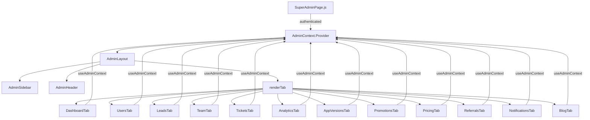

# Design Document: Super Admin Panel Redesign

## Overview

The BillByteKOT Super Admin Panel is being restructured from a 5846-line monolithic `SuperAdminPage.js` into a modular, maintainable architecture. The redesign introduces a sidebar-based navigation, React context for shared state, per-section TabComponents, and reusable shared components — while preserving 100% of existing functionality.

The entry point (`SuperAdminPage.js`) retains only authentication logic. After login, it renders `AdminContext.Provider` wrapping `AdminLayout`, which composes the sidebar, header, and active tab content.

**Goals:**
- Each file under 300 lines
- Zero regression in existing features
- Responsive layout (mobile + desktop)
- Permission-based access for `team` users
- Consistent loading/empty states across all sections

---

## Architecture



**Data flow:** All TabComponents read `credentials` from `AdminContext` and make their own API calls. No data is fetched at the layout level (except dashboard KPIs). State for each section lives entirely within its TabComponent.

---

## Components and Interfaces

### File Structure

```
frontend/src/pages/SuperAdminPage.js          ← thin entry point (auth only)
frontend/src/pages/superadmin/
  AdminContext.js
  AdminLayout.js
  AdminSidebar.js
  AdminHeader.js
  DashboardTab.js
  UsersTab.js
  LeadsTab.js
  TeamTab.js
  TicketsTab.js
  AnalyticsTab.js
  AppVersionsTab.js
  PromotionsTab.js
  PricingTab.js
  ReferralsTab.js
  NotificationsTab.js
  BlogTab.js
  shared/
    LoadingSkeleton.js
    EmptyState.js
    KPICard.js
```

### AdminContext.js

```js
const AdminContext = createContext(null);

export const AdminProvider = ({ credentials, userType, teamUser, children }) => {
  const [activeSection, setActiveSection] = useState('dashboard');

  const hasPermission = (perm) => {
    if (userType === 'super-admin') return true;
    if (!perm) return false; // null permission = super-admin only
    return teamUser?.permissions?.includes(perm) ?? false;
  };

  return (
    <AdminContext.Provider value={{ credentials, userType, teamUser, activeSection, setActiveSection, hasPermission }}>
      {children}
    </AdminContext.Provider>
  );
};

export const useAdminContext = () => {
  const ctx = useContext(AdminContext);
  if (!ctx) throw new Error('useAdminContext must be used within AdminProvider');
  return ctx;
};
```

**Provided values:**

| Value | Type | Description |
|---|---|---|
| `credentials` | `{ username, password }` | Passed to all API calls via `params` |
| `userType` | `'super-admin' \| 'team'` | Determines access level |
| `teamUser` | `object \| null` | Team user object with `permissions[]` |
| `activeSection` | `string` | Currently active nav item id |
| `setActiveSection` | `fn(string)` | Navigate to a section |
| `hasPermission(perm)` | `fn → boolean` | Permission check utility |

### AdminLayout.js

```jsx
const AdminLayout = ({ onLogout }) => {
  const { activeSection, setActiveSection, userType } = useAdminContext();
  const [sidebarOpen, setSidebarOpen] = useState(false);

  const renderTab = () => {
    switch (activeSection) {
      case 'dashboard': return <DashboardTab />;
      case 'users':     return <UsersTab />;
      // ... all 12 tabs
    }
  };

  return (
    <div className="flex h-screen bg-gray-50">
      {/* Desktop sidebar */}
      <div className="hidden md:flex w-64 flex-shrink-0">
        <AdminSidebar onNavigate={(id) => setActiveSection(id)} />
      </div>
      {/* Mobile overlay */}
      {sidebarOpen && (
        <div className="fixed inset-0 z-40 md:hidden">
          <div className="absolute inset-0 bg-black/50" onClick={() => setSidebarOpen(false)} />
          <div className="absolute left-0 top-0 h-full w-64 z-50">
            <AdminSidebar onNavigate={(id) => { setActiveSection(id); setSidebarOpen(false); }} />
          </div>
        </div>
      )}
      {/* Content */}
      <div className="flex-1 flex flex-col overflow-hidden">
        <AdminHeader onMenuToggle={() => setSidebarOpen(true)} onLogout={onLogout} />
        <main className="flex-1 overflow-auto p-6">
          {renderTab()}
        </main>
      </div>
    </div>
  );
};
```

### AdminSidebar.js

Navigation groups and items:

```js
const NAV_GROUPS = [
  { label: 'Overview', items: [
    { id: 'dashboard', label: 'Dashboard', icon: LayoutDashboard, permission: 'analytics' }
  ]},
  { label: 'User Management', items: [
    { id: 'users',  label: 'Users',  icon: Users,      permission: 'users' },
    { id: 'leads',  label: 'Leads',  icon: Target,     permission: 'leads' },
    { id: 'team',   label: 'Team',   icon: UserCheck,  permission: 'team' },
  ]},
  { label: 'Support', items: [
    { id: 'tickets', label: 'Tickets', icon: Ticket, permission: 'tickets' }
  ]},
  { label: 'Analytics', items: [
    { id: 'analytics', label: 'Analytics', icon: BarChart3, permission: 'analytics' }
  ]},
  { label: 'Growth', items: [
    { id: 'promotions', label: 'Promotions', icon: Flame,      permission: null },
    { id: 'pricing',    label: 'Pricing',    icon: DollarSign, permission: null },
    { id: 'referrals',  label: 'Referrals',  icon: Gift,       permission: null },
  ]},
  { label: 'Content', items: [
    { id: 'blog', label: 'Blog', icon: BookOpen, permission: null }
  ]},
  { label: 'System', items: [
    { id: 'app-versions',  label: 'App Versions',  icon: Smartphone, permission: null },
    { id: 'notifications', label: 'Notifications', icon: Bell,       permission: null },
  ]},
];
```

`permission: null` means the item is only visible to `super-admin`. A group is rendered only if at least one of its items passes `hasPermission`.

**Visual design:**
- Background: `bg-gray-900`
- Active item: `bg-purple-600 text-white rounded-lg`
- Inactive item: `text-gray-400 hover:text-white hover:bg-gray-800 rounded-lg`
- Group label: `text-gray-500 text-xs font-semibold uppercase tracking-wider px-3 mb-1`
- Logo area: `bg-gray-950` with BillByteKOT wordmark in white
- Bottom: user avatar (initials) + name + role badge

### AdminHeader.js

```jsx
const AdminHeader = ({ onMenuToggle, onLogout }) => {
  const { activeSection, userType } = useAdminContext();
  const sectionTitle = SECTION_TITLES[activeSection] ?? activeSection;

  return (
    <header className="bg-white border-b border-gray-200 px-4 py-3 flex items-center justify-between">
      <div className="flex items-center gap-3">
        <button className="md:hidden" onClick={onMenuToggle}><Menu /></button>
        <h1 className="text-xl font-bold text-gray-900">{sectionTitle}</h1>
      </div>
      <div className="flex items-center gap-3">
        {userType === 'super-admin' && <GlobalSearch />}
        <AutoRefreshIndicator />
        <NotificationBell />
        <UserAvatar />
        <Button variant="outline" size="sm" onClick={onLogout}>Logout</Button>
      </div>
    </header>
  );
};
```

### Tab Component Pattern

Every TabComponent follows this standard pattern:

```jsx
const UsersTab = () => {
  const { credentials, hasPermission } = useAdminContext();
  const [data, setData] = useState([]);
  const [loading, setLoading] = useState(true);
  const [error, setError] = useState(null);

  useEffect(() => { fetchData(); }, []);

  const fetchData = async () => {
    setLoading(true);
    try {
      const res = await axios.get(`${API}/super-admin/users`, { params: credentials });
      setData(res.data);
    } catch (e) {
      setError(e.message);
    } finally {
      setLoading(false);
    }
  };

  if (loading) return <LoadingSkeleton variant="table-rows" />;
  if (error)   return <ErrorState message={error} onRetry={fetchData} />;
  if (!data.length) return <EmptyState icon={Users} title="No users yet" description="Users will appear here once they sign up." />;
  return <div>...existing users UI...</div>;
};
```

### Shared Components

**LoadingSkeleton.js**

```jsx
const LoadingSkeleton = ({ variant = 'table-rows', rows = 5 }) => {
  if (variant === 'kpi-grid') return (
    <div className="grid grid-cols-2 md:grid-cols-3 xl:grid-cols-6 gap-4">
      {Array(6).fill(0).map((_, i) => (
        <div key={i} className="bg-white rounded-xl border p-4 animate-pulse">
          <div className="h-3 bg-gray-200 rounded w-2/3 mb-3" />
          <div className="h-7 bg-gray-200 rounded w-1/2 mb-2" />
          <div className="h-3 bg-gray-200 rounded w-1/3" />
        </div>
      ))}
    </div>
  );
  if (variant === 'table-rows') return (
    <div className="space-y-2 animate-pulse">
      {Array(rows).fill(0).map((_, i) => (
        <div key={i} className="h-12 bg-gray-200 rounded-lg" />
      ))}
    </div>
  );
  // 'form' and 'chart' variants follow similar pattern
};
```

**EmptyState.js**

```jsx
const EmptyState = ({ icon: Icon, title, description, action }) => (
  <div className="flex flex-col items-center justify-center py-16 text-center">
    <Icon className="w-12 h-12 text-gray-300 mb-4" />
    <h3 className="font-semibold text-gray-700 mb-1">{title}</h3>
    <p className="text-gray-500 text-sm mb-4">{description}</p>
    {action && <Button onClick={action.onClick}>{action.label}</Button>}
  </div>
);
```

**KPICard.js**

```jsx
const KPICard = ({ title, value, change, icon: Icon, color }) => (
  <div className="bg-white rounded-xl border p-4 flex items-start justify-between">
    <div>
      <p className="text-xs text-gray-500 font-medium uppercase tracking-wide">{title}</p>
      <p className="text-2xl font-black text-gray-900 mt-1">{value}</p>
      <p className={`text-xs mt-1 flex items-center gap-1 ${change >= 0 ? 'text-green-600' : 'text-red-500'}`}>
        {change >= 0 ? <ArrowUp className="w-3 h-3" /> : <ArrowDown className="w-3 h-3" />}
        {Math.abs(change)}% vs last period
      </p>
    </div>
    <div className={`w-10 h-10 rounded-xl ${color} flex items-center justify-center`}>
      <Icon className="w-5 h-5 text-white" />
    </div>
  </div>
);
```

---

## Data Models

### AdminContext Value Shape

```ts
interface AdminContextValue {
  credentials: { username: string; password: string };
  userType: 'super-admin' | 'team';
  teamUser: TeamUser | null;
  activeSection: string;
  setActiveSection: (section: string) => void;
  hasPermission: (permission: string | null) => boolean;
}

interface TeamUser {
  username: string;
  full_name?: string;
  role: string;
  permissions: string[];
}
```

### NavItem Shape

```ts
interface NavItem {
  id: string;
  label: string;
  icon: LucideIcon;
  permission: string | null; // null = super-admin only
}

interface NavGroup {
  label: string;
  items: NavItem[];
}
```

### KPI Card Data Shape

```ts
interface KPICardData {
  title: string;
  value: string | number;
  change: number;       // percentage, positive = up, negative = down
  icon: LucideIcon;
  color: string;        // Tailwind bg class e.g. 'bg-blue-500'
}
```

### Dashboard KPI Cards

| Title | Icon | Color |
|---|---|---|
| Total Users | Users | `bg-blue-500` |
| Active Subscriptions | CreditCard | `bg-green-500` |
| Monthly Revenue | TrendingUp | `bg-purple-500` |
| Open Tickets | Ticket | `bg-orange-500` |
| New Leads 7d | Target | `bg-pink-500` |
| App Installs | Smartphone | `bg-cyan-500` |

### DashboardTab Layout

```
┌─────────────────────────────────────────────────────────┐
│  KPI Grid (2 cols mobile / 3 cols tablet / 6 cols desk) │
├──────────────────────────────┬──────────────────────────┤
│  Revenue Chart (2/3 width)   │  Recent Activity (1/3)   │
├──────────────────────────────┴──────────────────────────┤
│  System Health Row (API | DB | Uptime | Memory)         │
└─────────────────────────────────────────────────────────┘
```

### SuperAdminPage.js (Entry Point) State

After restructure, only auth state remains here:

```js
const [authenticated, setAuthenticated] = useState(false);
const [credentials, setCredentials] = useState({ username: '', password: '' });
const [userType, setUserType] = useState(null);
const [teamUser, setTeamUser] = useState(null);
const [teamToken, setTeamToken] = useState(null);
```

All 50+ tab-specific state variables move into their respective TabComponents.

### Permission → Section Mapping

| Permission token | Sections accessible |
|---|---|
| `'analytics'` | Dashboard, Analytics |
| `'users'` | Users |
| `'leads'` | Leads |
| `'tickets'` | Tickets |
| `'team'` | Team |
| `null` (super-admin only) | Promotions, Pricing, Referrals, Blog, App Versions, Notifications |

---


## Correctness Properties

*A property is a characteristic or behavior that should hold true across all valid executions of a system — essentially, a formal statement about what the system should do. Properties serve as the bridge between human-readable specifications and machine-verifiable correctness guarantees.*

### Property 1: Permission-based sidebar filtering

*For any* team user with any set of permission tokens, the sidebar should render exactly the navigation items whose `permission` field is included in that user's permissions array, and no items with `permission: null` (super-admin only).

**Validates: Requirements 2.6, 8.1**

---

### Property 2: hasPermission correctness

*For any* user type and permission token: if the user is `super-admin`, `hasPermission` returns `true` for all tokens including `null`; if the user is `team`, `hasPermission` returns `true` only for tokens present in their permissions array and `false` for `null` tokens.

**Validates: Requirements 4.2, 8.5**

---

### Property 3: Active nav item styling

*For any* nav item id, when that id equals the current `activeSection`, the rendered nav item element should have the active CSS class (`bg-purple-600`), and all other nav items should not have that class.

**Validates: Requirements 2.5**

---

### Property 4: Sidebar user info rendering

*For any* user object with a `full_name` (or `username`) and `role`, the sidebar bottom section should contain a string matching that name and a string matching that role.

**Validates: Requirements 2.8**

---

### Property 5: Hamburger toggle opens sidebar

*For any* initial state where the sidebar is closed, clicking the hamburger button should result in the sidebar overlay being visible in the DOM.

**Validates: Requirements 3.3**

---

### Property 6: Mobile nav selection closes sidebar

*For any* open sidebar state, selecting any navigation item should result in the sidebar overlay being removed from the DOM.

**Validates: Requirements 3.4**

---

### Property 7: AdminContext exposes all required values

*For any* set of initial props passed to `AdminProvider`, the context value consumed by a child should contain all of: `credentials`, `userType`, `teamUser`, `activeSection`, `setActiveSection`, and `hasPermission`.

**Validates: Requirements 4.1**

---

### Property 8: Tab component loading/error/empty state transitions

*For any* tab component, the rendered output should follow this exclusive state machine: when `loading=true` → renders LoadingSkeleton; when `loading=false` and `error` is set → renders error UI with retry button; when `loading=false`, no error, and `data` is empty → renders EmptyState; when `loading=false`, no error, and `data` is non-empty → renders content.

**Validates: Requirements 5.1, 5.4, 5.5, 6.1**

---

### Property 9: LoadingSkeleton table-rows renders correct row count

*For any* `rows` value N passed to `LoadingSkeleton` with `variant="table-rows"`, the rendered output should contain exactly N skeleton row elements.

**Validates: Requirements 5.3**

---

### Property 10: EmptyState renders all required elements

*For any* `EmptyState` rendered with an `icon`, `title`, `description`, and `action` prop, the output should contain an icon element, the title text, the description text, and a button with the action label.

**Validates: Requirements 6.2**

---

### Property 11: KPICard renders all data fields with correct trend color

*For any* `KPICard` props with a `title`, `value`, `change`, `icon`, and `color`: the rendered output should contain the title text, the value text, and the absolute change percentage; when `change >= 0` the trend element should have a green color class; when `change < 0` the trend element should have a red color class.

**Validates: Requirements 7.3, 7.4, 7.5**

---

### Property 12: Dashboard renders all 6 KPI cards

*For any* dashboard data response, the DashboardTab should render exactly 6 KPICard components with titles matching: Total Users, Active Subscriptions, Monthly Revenue, Open Tickets, New Leads (7d), App Installs.

**Validates: Requirements 7.2**

---

### Property 13: Recent Activity feed respects 20-item limit

*For any* activity list of length N, the Recent Activity feed should render at most 20 items regardless of N.

**Validates: Requirements 7.7**

---

### Property 14: Permission redirect enforcement

*For any* team user with a given permissions set, attempting to set `activeSection` to a section they do not have permission for should result in `activeSection` being set to their first permitted section instead.

**Validates: Requirements 8.2, 8.3**

---

### Property 15: AdminLayout renders correct tab for activeSection

*For any* `activeSection` value that maps to a known section id, `AdminLayout` should render exactly the corresponding TabComponent and no other TabComponent.

**Validates: Requirements 10.2, 10.3**

---

### Property 16: Each TabComponent renders in isolation

*For any* TabComponent, when rendered inside a mock `AdminProvider` with valid credentials and mocked API responses, it should render without throwing an error.

**Validates: Requirements 10.5**

---

### Property 17: Header displays correct section title

*For any* `activeSection` value, the header should display the human-readable title corresponding to that section id (e.g., `'users'` → `'Users'`, `'app-versions'` → `'App Versions'`).

**Validates: Requirements 11.2**

---

### Property 18: Header search visibility by user type

*For any* user type, the global search input should be present in the header DOM when `userType === 'super-admin'` and absent when `userType === 'team'`.

**Validates: Requirements 11.4**

---

### Property 19: Notification bell badge visibility

*For any* unread notification count N: when N > 0, the notification bell should render a badge element containing N; when N === 0, no badge should be rendered.

**Validates: Requirements 11.5**

---

## Error Handling

### API Errors

Every TabComponent wraps its fetch calls in try/catch. On failure:
- `setError(e.message)` is called
- The component renders an `ErrorState` with the message and a "Retry" button
- Retrying calls `fetchData()` again, resetting `error` to `null` and `loading` to `true`

### Context Outside Provider

`useAdminContext` throws `Error('useAdminContext must be used within AdminProvider')` if called outside the provider tree. This surfaces misconfigured component trees immediately during development.

### Permission Violations

If `activeSection` is set to a section the current user cannot access (e.g., via direct URL manipulation or stale state), `AdminLayout` falls back to the user's first permitted section. For `super-admin`, all sections are always accessible.

### Empty/Null Data

TabComponents treat `null`, `undefined`, and `[]` as empty states. The `EmptyState` component is shown rather than crashing on `.map()` of null.

### Network Timeout

API calls do not set explicit timeouts (consistent with existing behavior). The loading skeleton remains visible until the request resolves or rejects.

---

## Testing Strategy

### Dual Testing Approach

Both unit tests and property-based tests are required. They are complementary:
- Unit tests catch specific regressions and verify concrete examples
- Property tests verify universal correctness across all inputs

### Property-Based Testing

**Library:** `@fast-check/jest` (fast-check with Jest integration) for React component testing.

Each property test runs a minimum of 100 iterations. Tests are tagged with a comment referencing the design property.

Tag format: `// Feature: super-admin-panel-redesign, Property N: <property_text>`

Each correctness property above maps to exactly one property-based test.

**Example property test:**

```js
// Feature: super-admin-panel-redesign, Property 11: KPICard renders all data fields with correct trend color
test('KPICard renders correct trend color for any change value', () => {
  fc.assert(fc.property(
    fc.record({
      title: fc.string({ minLength: 1 }),
      value: fc.oneof(fc.string(), fc.integer()),
      change: fc.float({ noNaN: true }),
      color: fc.constantFrom('bg-blue-500', 'bg-green-500', 'bg-purple-500'),
    }),
    ({ title, value, change, color }) => {
      const { container } = render(
        <KPICard title={title} value={value} change={change} icon={Users} color={color} />
      );
      const trendEl = container.querySelector('[data-testid="trend"]');
      if (change >= 0) {
        expect(trendEl.className).toContain('text-green-600');
      } else {
        expect(trendEl.className).toContain('text-red-500');
      }
    }
  ), { numRuns: 100 });
});
```

### Unit Tests

Unit tests focus on:
- Specific empty state messages (Requirements 6.3, 6.4, 6.5)
- File structure existence (Requirements 1.1–1.5)
- `useAdminContext` throws outside provider (Requirement 4.5)
- Sidebar renders logo and user info (Requirements 2.7, 2.8)
- Header renders logout button (Requirement 11.3)
- Dashboard renders chart and system health (Requirements 7.6, 7.8)

### Integration Tests

- Full login flow → AdminLayout renders with correct initial section
- Team user login → only permitted sections visible in sidebar
- Tab switching → correct component mounts, previous unmounts
- API error → error state shown with retry button

### Test File Locations

```
frontend/src/pages/superadmin/__tests__/
  AdminContext.test.js
  AdminSidebar.test.js
  AdminHeader.test.js
  AdminLayout.test.js
  DashboardTab.test.js
  shared/KPICard.test.js
  shared/EmptyState.test.js
  shared/LoadingSkeleton.test.js
```
